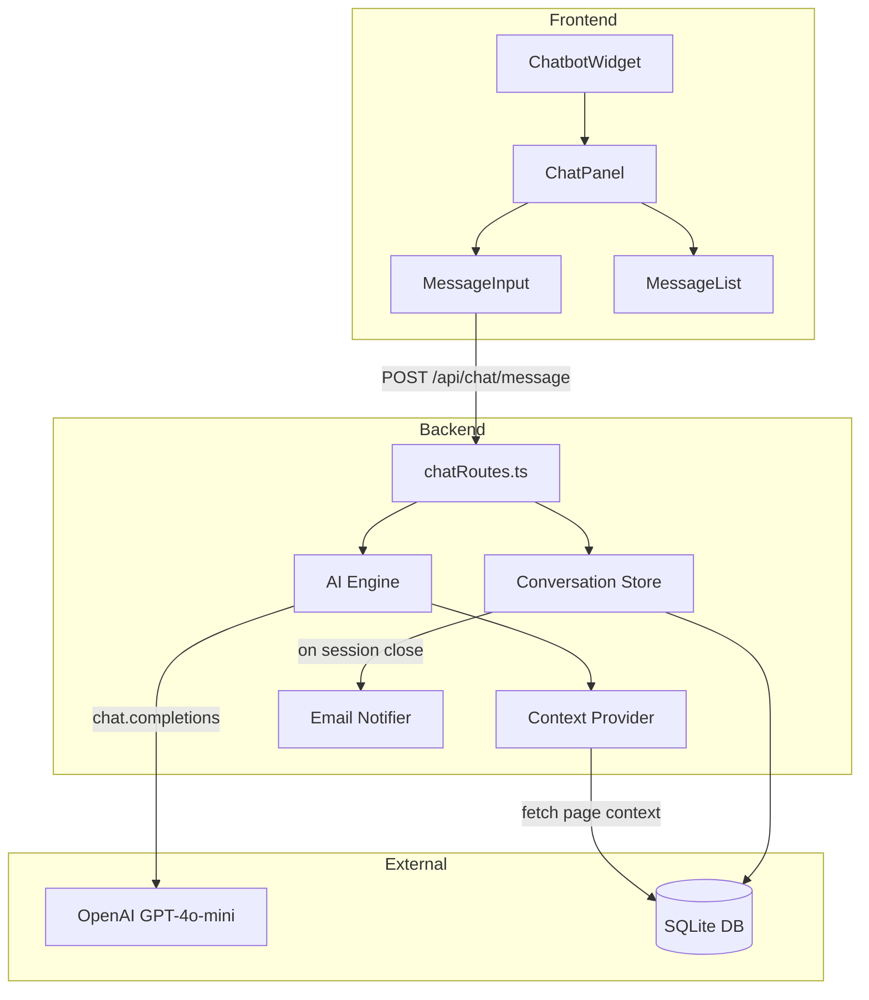
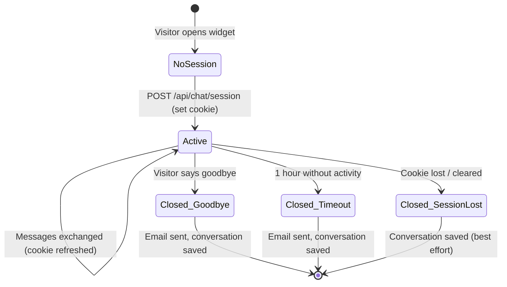

# Design Document: AI Chatbot Widget

## Overview

This feature replaces the existing WhatsApp floating bubble with an AI-powered chatbot widget on robles.ai. The system consists of a React chat widget (frontend), a set of Express API endpoints (backend), an AI engine powered by GPT-4o-mini, a page context provider, and SQLite-backed conversation storage. Conversations are persisted per session, contact data is naturally collected, and admins can review all interactions through the existing admin panel.

The design prioritizes:
- **Minimal new dependencies** — reuses OpenAI SDK, better-sqlite3, nodemailer, and existing auth
- **Session-based state** — a single cookie identifies the visitor across tabs
- **Streaming-friendly architecture** — uses Server-Sent Events (SSE) for real-time AI responses
- **Clean separation** — Context Provider, AI Engine, and Conversation Store are independent modules

## Architecture



### Data Flow

1. Visitor opens widget → frontend checks for session cookie → if exists, fetches conversation history via `GET /api/chat/history`
2. Visitor sends message → `POST /api/chat/message` with message content and current page path
3. Backend stores visitor message → Context Provider assembles page context if needed → AI Engine calls OpenAI → response streamed via SSE
4. AI response stored in DB → streamed to frontend in real-time
5. Session closes (timeout/goodbye/tab close) → Conversation Store marks as closed → Email Notifier sends transcript

## Components and Interfaces

### Frontend Components

| Component | Responsibility |
|-----------|---------------|
| `ChatbotWidget` | Root component — renders bubble + panel, manages open/close state |
| `ChatPanel` | Conversation view — message list, input, WhatsApp button, close button |
| `MessageList` | Renders message bubbles with timestamps and sender indicators |
| `MessageInput` | Text input with send button, handles Enter key submission |
| `useChatSession` | Custom hook — manages session cookie, message state, SSE connection |

### Backend Modules

| Module | File | Responsibility |
|--------|------|---------------|
| Chat Routes | `server/chatRoutes.ts` | Express router for all chat API endpoints |
| AI Engine | `server/services/chatEngine.ts` | Builds prompts, calls OpenAI, handles streaming |
| Context Provider | `server/services/chatContext.ts` | Assembles page-specific context for AI prompts |
| Conversation Store | `server/services/conversationStore.ts` | CRUD operations on conversations, messages, contacts |
| Email Notifier | `server/services/chatNotifier.ts` | Sends email on conversation close |

### API Endpoints

| Method | Path | Auth | Description |
|--------|------|------|-------------|
| `POST` | `/api/chat/session` | None | Creates a new session, returns session ID cookie |
| `GET` | `/api/chat/history` | Session cookie | Returns conversation messages for current session |
| `POST` | `/api/chat/message` | Session cookie | Sends visitor message, returns SSE stream with AI response |
| `POST` | `/api/chat/close` | Session cookie | Explicitly closes the session (goodbye) |
| `GET` | `/api/admin/conversations` | Admin JWT | Paginated list with filters |
| `GET` | `/api/admin/conversations/:id` | Admin JWT | Full conversation detail with messages and contact data |
| `GET` | `/api/admin/conversations/analytics` | Admin JWT | Aggregated stats for date range |

### Interface Contracts

```typescript
// POST /api/chat/message request body
interface ChatMessageRequest {
  message: string;
  pagePath: string; // current page route, e.g. "/blog/ai-in-healthcare"
}

// GET /api/chat/history response
interface ChatHistoryResponse {
  messages: ChatMessage[];
  contactData: ContactData | null;
  status: 'open' | 'closed';
}

interface ChatMessage {
  id: number;
  role: 'visitor' | 'assistant';
  content: string;
  timestamp: string; // ISO 8601
}

interface ContactData {
  name: string | null;
  lastName: string | null;
  email: string | null;
  phone: string | null;
  company: string | null;
}

// GET /api/admin/conversations query params
interface ConversationListParams {
  page?: number;        // default 1
  limit?: number;       // default 20, max 100
  dateFrom?: string;    // ISO date
  dateTo?: string;      // ISO date
  hasContact?: boolean; // filter to only conversations with contact data
  status?: 'open' | 'closed';
}

// GET /api/admin/conversations response
interface ConversationListResponse {
  conversations: ConversationSummary[];
  total: number;
  page: number;
  limit: number;
}

interface ConversationSummary {
  id: number;
  visitorName: string | null;
  status: 'open' | 'closed';
  closureReason: 'timeout' | 'goodbye' | 'session_lost' | null;
  messageCount: number;
  createdAt: string;
  lastMessageAt: string;
}

// GET /api/admin/conversations/analytics response
interface ConversationAnalytics {
  totalConversations: number;
  contactCaptureRate: number; // 0-100
  averageMessages: number;
  topTopics: { topic: string; count: number }[];
}
```

## Data Models

### Database Schema

All tables are created in the existing `server/data/dominical.db` SQLite database.

```sql
CREATE TABLE IF NOT EXISTS chat_conversations (
  id INTEGER PRIMARY KEY AUTOINCREMENT,
  session_id TEXT NOT NULL UNIQUE,
  status TEXT NOT NULL DEFAULT 'open' CHECK(status IN ('open', 'closed')),
  closure_reason TEXT CHECK(closure_reason IN ('timeout', 'goodbye', 'session_lost')),
  created_at TEXT NOT NULL,
  last_message_at TEXT NOT NULL,
  closed_at TEXT
);

CREATE TABLE IF NOT EXISTS chat_messages (
  id INTEGER PRIMARY KEY AUTOINCREMENT,
  conversation_id INTEGER NOT NULL,
  role TEXT NOT NULL CHECK(role IN ('visitor', 'assistant')),
  content TEXT NOT NULL,
  created_at TEXT NOT NULL,
  FOREIGN KEY (conversation_id) REFERENCES chat_conversations(id)
);

CREATE TABLE IF NOT EXISTS chat_contacts (
  id INTEGER PRIMARY KEY AUTOINCREMENT,
  conversation_id INTEGER NOT NULL UNIQUE,
  name TEXT,
  last_name TEXT,
  email TEXT,
  phone TEXT,
  company TEXT,
  updated_at TEXT NOT NULL,
  FOREIGN KEY (conversation_id) REFERENCES chat_conversations(id)
);

CREATE INDEX IF NOT EXISTS idx_chat_messages_conversation
  ON chat_messages(conversation_id);
CREATE INDEX IF NOT EXISTS idx_chat_conversations_status
  ON chat_conversations(status);
CREATE INDEX IF NOT EXISTS idx_chat_conversations_created
  ON chat_conversations(created_at);
CREATE INDEX IF NOT EXISTS idx_chat_conversations_session
  ON chat_conversations(session_id);
```

### Session Cookie

- **Name:** `chat_session`
- **Value:** UUID v4
- **httpOnly:** true
- **secure:** true in production
- **sameSite:** `lax` (needed for cross-tab access)
- **maxAge:** 3600 seconds (1 hour) — rolling: refreshed on each message

### AI System Prompt Design

The system prompt is composed of three layers:

1. **Base prompt** — defines the assistant's identity, tone, and guardrails (Topic_Guard)
2. **Contact collection directive** — instructs natural data collection behavior
3. **Page context** (dynamic) — injected only when the Context Provider determines it's relevant

```
[Base Identity]
You are the Robles.AI assistant on robles.ai. You help visitors understand
Robles.AI's services in AI/ML, computer vision, data science, and related fields.
Keep responses concise (2-4 sentences). Be warm, professional, and knowledgeable.

[Topic Guard]
If a visitor asks about topics unrelated to AI, ML, data science, Robles.AI services,
or the current page content, politely redirect them. Example: "That's an interesting
topic! I specialize in AI and ML though — is there something about Robles.AI's
services I can help with?"

[Contact Collection]
Naturally work toward learning the visitor's name, and either their email or phone
number. Do NOT ask for all fields at once. Weave requests into the conversation flow.
Once you have their name and at least one contact method, stop requesting information.
Never be pushy if they decline.

[Page Context — dynamic]
The visitor is currently viewing: {pagePath}
Relevant page content:
{pageContent}
```

### Context Provider Logic

The Context Provider determines whether to inject page content:

1. **Blog posts** (`/blog/:slug`) → Fetch full post content from the blog JSON files
2. **Homepage** (`/`) → Inject a summary of Robles.AI services, solutions, and features
3. **Demo pages** (`/try-*`) → Inject description of that specific demo
4. **Other pages** → Inject a brief description based on the route

Context is loaded lazily — only when the visitor's message references page content or when it's the first message (to establish context). Subsequent messages reuse the cached context for the session.

### Contact Data Extraction

The AI Engine uses a structured output tool call to extract contact data from the conversation. After each assistant response, the engine checks if new contact fields are present using a secondary prompt:

```typescript
// After AI responds, run extraction with function calling
const extraction = await openai.chat.completions.create({
  model: 'gpt-4o-mini',
  messages: conversationHistory,
  tools: [{
    type: 'function',
    function: {
      name: 'update_contact',
      description: 'Extract and update contact information mentioned by the visitor',
      parameters: {
        type: 'object',
        properties: {
          name: { type: 'string' },
          lastName: { type: 'string' },
          email: { type: 'string' },
          phone: { type: 'string' },
          company: { type: 'string' },
        },
      },
    },
  }],
  tool_choice: 'auto',
});
```

This avoids regex-based extraction and leverages the LLM's natural language understanding.

### Session Management Strategy



- **Timeout detection:** A server-side job runs every 5 minutes, queries conversations with `status = 'open'` and `last_message_at` older than 1 hour, closes them with reason `timeout`
- **Goodbye detection:** The AI Engine includes a `close_conversation` tool in its available tools. When the visitor says goodbye, the model calls this tool, which triggers closure
- **Session loss:** On frontend mount, if cookie exists but API returns 404 (conversation not found or already closed), start a new session

### SSE Streaming

The `POST /api/chat/message` endpoint returns a Server-Sent Events stream:

```
Content-Type: text/event-stream

data: {"type":"token","content":"Hello"}
data: {"type":"token","content":" there!"}
data: {"type":"token","content":" How"}
data: {"type":"done","messageId":42}
data: {"type":"contact_update","data":{"name":"Antonio"}}
```

This allows the frontend to render tokens as they arrive, providing immediate feedback.

### Admin Panel Integration

New sidebar entry `Conversations` added to `AdminLayout.tsx` navLinks array. Three new pages:

- `/admin/conversations` → `AdminConversationList.tsx` — paginated table with filters
- `/admin/conversations/:id` → `AdminConversationDetail.tsx` — full transcript view
- `/admin/conversations/analytics` accessible from a tab within the list page

The admin endpoints reuse the existing `requireAuth` middleware.

## Correctness Properties

*A property is a characteristic or behavior that should hold true across all valid executions of a system — essentially, a formal statement about what the system should do. Properties serve as the bridge between human-readable specifications and machine-verifiable correctness guarantees.*

### Property 1: Session cookie round-trip identity

*For any* valid session ID, creating a session via `POST /api/chat/session` and then requesting history via `GET /api/chat/history` with the returned cookie SHALL return a conversation object belonging to that same session (empty messages array, status open), and no other session SHALL share that conversation.

**Validates: Requirements 3.1, 3.2**

### Property 2: Message persistence completeness

*For any* sequence of N visitor messages sent to a conversation, querying `GET /api/chat/history` SHALL return exactly N visitor messages and N assistant responses, each with a valid role, non-empty content, and ISO 8601 timestamp, in strictly chronological order with no messages lost or duplicated.

**Validates: Requirements 5.1, 5.2, 10.1**

### Property 3: Contact data extraction idempotence

*For any* conversation message history containing contact information, calling the contact extraction function multiple times SHALL produce identical contact data fields — the stored contact record is never duplicated or corrupted, and the `conversation_id` foreign key always references a valid conversation.

**Validates: Requirements 4.2, 4.3, 5.3**

### Property 4: Session expiry boundary

*For any* open conversation, if the difference between the current time and `last_message_at` exceeds 3600 seconds, the timeout cleanup job SHALL close it with `closure_reason = 'timeout'`. If the difference is less than or equal to 3600 seconds, the job SHALL NOT modify it.

**Validates: Requirements 3.3**

### Property 5: Conversation closure completeness

*For any* conversation that transitions from `open` to `closed` (regardless of closure reason: timeout, goodbye, or session_lost), the resulting database state SHALL have: status = 'closed', a valid `closure_reason`, a non-null `closed_at` timestamp, all messages intact, and any captured contact data linked via `conversation_id`.

**Validates: Requirements 3.5, 5.4**

### Property 6: Email notification completeness

*For any* closed conversation with M messages and optional contact data, the generated email HTML SHALL contain: all M messages in chronological order with their roles, all non-null contact fields in a header section (or a "no contact information" notice if all fields are null), and a valid subject line.

**Validates: Requirements 6.1, 6.2, 6.3, 6.4**

### Property 7: Admin conversation list pagination and filtering

*For any* set of N conversations in the database and query parameters (page, limit, dateFrom, dateTo, hasContact, status), the response SHALL: return at most `limit` items, report `total` equal to the count of conversations matching all applied filters, ensure all returned items match every active filter, and ensure sequential pages cover all matching conversations without overlap or omission.

**Validates: Requirements 9.1, 9.2, 9.3, 9.4, 9.5**

### Property 8: Analytics computation correctness

*For any* set of conversations within a date range, the analytics response SHALL: report `totalConversations` equal to the count of conversations created within that range, compute `contactCaptureRate` as (conversations with non-null name AND (email OR phone)) / total × 100, and compute `averageMessages` as sum of message counts / total conversations.

**Validates: Requirements 11.1, 11.2, 11.4**

### Property 9: Context provider page-awareness

*For any* page path matching `/blog/:slug` where the slug exists in the blog database, the Context_Provider SHALL return context containing that post's title and body content. *For any* request from the homepage path `/`, the context SHALL include Robles.AI service descriptions. *For any* two distinct page paths, the assembled context SHALL differ.

**Validates: Requirements 2.1, 2.2, 2.3, 2.4**

## Error Handling

| Scenario | Handling Strategy |
|----------|-------------------|
| OpenAI API timeout (>10s) | Return SSE error event `{"type":"error","message":"..."}`, store no assistant message, allow retry |
| OpenAI API rate limit | Return 429 with `Retry-After` header, frontend shows "Please wait" message |
| OpenAI API key missing | Return 503, log error server-side, frontend shows "Service unavailable" |
| Invalid session cookie | Return 401, frontend clears cookie and shows fresh widget state |
| Expired session (1h) | Return 410 Gone, frontend starts new session automatically |
| Database write failure | Return 500, log error, frontend shows retry option |
| Email send failure | Log error, do not fail the session closure — email is best-effort |
| Malformed message (empty/too long) | Return 400 with validation error, max message length: 2000 chars |
| Context provider fails to fetch blog post | Continue without page context, log warning |

### Rate Limiting

- **Per session:** Max 30 messages per 10-minute window
- **Global:** Max 100 concurrent OpenAI requests (controlled via a semaphore)
- Implementation: In-memory counter per session ID, reset every 10 minutes

## Testing Strategy

### Unit Tests (vitest)

- **Conversation Store:** CRUD operations, session lookup, timeout detection, closure logic
- **Context Provider:** Correct context assembly for each page type, caching behavior
- **Contact extraction:** Parsing tool call responses, merging partial contact data
- **Email Notifier:** Correct HTML template generation, handling missing contact data
- **Admin endpoints:** Pagination math, filter application, analytics aggregation
- **Rate limiter:** Counter increment, window reset, limit enforcement

### Property-Based Tests (fast-check + vitest)

The project already includes `fast-check` as a dev dependency. Property tests will validate the correctness properties defined above.

- Each property test runs a minimum of **100 iterations**
- Tag format: `Feature: ai-chatbot-widget, Property N: <property text>`
- Focus areas: session round-trip, message persistence ordering, pagination correctness, timeout boundary detection, contact extraction idempotence

### Integration Tests (supertest)

- Full request/response cycle for chat endpoints
- SSE stream parsing and token assembly
- Session cookie lifecycle (create, use, expire)
- Admin endpoint auth enforcement
- Email sending (mocked transport)

### Manual Testing

- Cross-tab session sharing behavior
- Mobile responsive layout
- WhatsApp button redirect
- Admin panel UX (filtering, pagination, detail view)
- AI response quality and topic guard effectiveness
