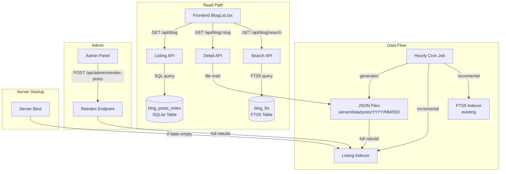
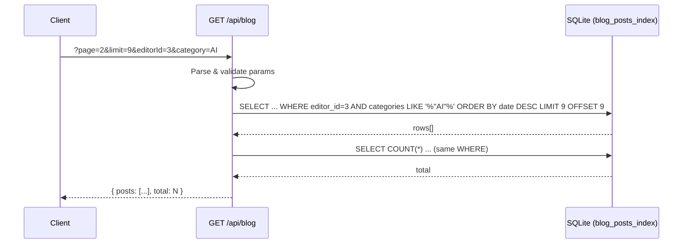
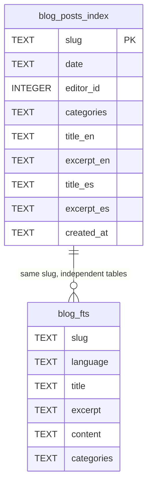

# Design Document: Blog Posts DB Index

## Overview

This feature replaces the current file-system scan approach in the `GET /api/blog` listing endpoint with indexed SQLite queries. The existing ~800+ JSON files remain the source of truth (written by the hourly cron), while a new `blog_posts_index` table serves as a derived read cache for listing, pagination, and filtering.

The architecture follows the same pattern as the existing FTS5 indexer (`server/fts/indexer.ts`): a dedicated module providing table creation, full rebuild, and incremental upsert functions. The listing API migrates from O(n) file reads to O(1) indexed SQL queries while maintaining the exact same response shape for frontend compatibility.

Key decisions:
- **SQLite in the same database** (`server/data/dominical.db`) — avoids managing multiple DB files; WAL mode handles concurrent reads.
- **INSERT OR REPLACE upsert** — simpler than merge logic; slug is the primary key.
- **Categories stored as JSON array string** — enables LIKE-based filtering without a join table, sufficient for the ~10 category values in use.
- **Independent from FTS5** — the listing index and search index operate on different tables and are called separately from the cron job.

## Architecture



### Request Flow — Listing API



## Components and Interfaces

### New Module: `server/listing/indexer.ts`

This module mirrors the pattern of `server/fts/indexer.ts` and provides all listing index operations.

```typescript
// server/listing/indexer.ts

import type Database from 'better-sqlite3';

// --- Interfaces ---

export interface ListingPostRow {
  slug: string;
  date: string;
  editor_id: number;
  categories: string;    // JSON array string, e.g. '["AI","Cloud"]'
  title_en: string | null;
  excerpt_en: string | null;
  title_es: string | null;
  excerpt_es: string | null;
  created_at: string;
}

export interface PostJson {
  slug: string;
  date: string;
  editorId: number;
  categories?: string[];
  translations: {
    en?: { title: string; excerpt: string; content: any[] };
    es?: { title: string; excerpt: string; content: any[] };
  };
}

// --- Table Management ---

/**
 * Creates the blog_posts_index table and its indexes if they don't exist.
 * Safe to call multiple times (uses IF NOT EXISTS).
 */
export function ensureListingTable(db: Database.Database): void;

// --- Content Extraction ---

/**
 * Extracts a ListingPostRow from a PostJson object.
 * Returns null if the post is missing required fields (slug, date, editorId).
 */
export function extractListingRow(post: PostJson): ListingPostRow | null;

// --- Full Rebuild ---

export interface RebuildResult {
  indexed: number;
  skipped: number;
}

/**
 * Rebuilds the entire blog_posts_index from JSON files on disk.
 * Runs in a single transaction: DELETE all + INSERT all.
 * Skips unparseable files with a warning log.
 * Returns counts of indexed and skipped files.
 */
export async function rebuildListingIndex(
  db: Database.Database,
  postsDir: string
): Promise<RebuildResult>;

// --- Incremental Indexing ---

/**
 * Upserts an array of posts into blog_posts_index.
 * Uses INSERT OR REPLACE (slug is PK).
 * Logs errors per-post and continues.
 */
export function indexListingPosts(db: Database.Database, posts: PostJson[]): void;
```

### Modified: `server/routes.ts` — Listing API

The `GET /api/blog` handler is rewritten to query `blog_posts_index` instead of scanning files.

```typescript
// Simplified handler — replaces the file-scan version

app.get('/api/blog', (req: Request, res: Response) => {
  try {
    let page = parseInt(req.query.page as string) || 1;
    let limit = parseInt(req.query.limit as string) || 9;
    if (limit > 100) limit = 100;
    const offset = (page - 1) * limit;

    const editorId = req.query.editorId ? parseInt(req.query.editorId as string) : null;
    const category = req.query.category as string | undefined;

    // Build dynamic WHERE clause
    const conditions: string[] = [];
    const params: any[] = [];

    if (editorId) {
      conditions.push('editor_id = ?');
      params.push(editorId);
    }
    if (category) {
      conditions.push("categories LIKE ?");
      params.push(`%"${category}"%`);
    }

    const whereClause = conditions.length > 0 ? `WHERE ${conditions.join(' AND ')}` : '';

    // Query posts
    const posts = db.prepare(`
      SELECT slug, date, editor_id, categories, title_en, excerpt_en, title_es, excerpt_es
      FROM blog_posts_index
      ${whereClause}
      ORDER BY date DESC
      LIMIT ? OFFSET ?
    `).all(...params, limit, offset);

    // Query total count
    const totalRow = db.prepare(`
      SELECT COUNT(*) as total FROM blog_posts_index ${whereClause}
    `).get(...params) as { total: number };

    // Transform to match current response shape
    const transformed = posts.map((row: any) => ({
      slug: row.slug,
      date: row.date,
      editorId: row.editor_id,
      translations: {
        en: { title: row.title_en || '', excerpt: row.excerpt_en || '' },
        es: { title: row.title_es || '', excerpt: row.excerpt_es || '' },
      },
    }));

    res.json({ posts: transformed, total: totalRow.total });
  } catch (err) {
    console.error('Error querying blog listing index:', err);
    res.status(500).json({ success: false, error: 'Failed to load posts' });
  }
});
```

### Modified: `server/adminRoutes.ts` — Reindex Endpoint

```typescript
// POST /api/admin/reindex-posts (protected)
adminRouter.post('/reindex-posts', requireAuth, async (_req, res) => {
  try {
    const postsDir = path.resolve(process.cwd(), 'server/data/posts');
    const result = await rebuildListingIndex(db, postsDir);
    res.json({ success: true, indexed: result.indexed, skipped: result.skipped });
  } catch (err) {
    console.error('[Admin] Reindex error:', err);
    res.status(500).json({ success: false, error: 'Reindex failed' });
  }
});
```

### Modified: `server/routes.ts` — Cron Integration

After the existing FTS indexing block in the hourly cron:

```typescript
// Index newly generated posts into listing index (blog_posts_index)
try {
  if (posts.length > 0) {
    indexListingPosts(db, posts);
    console.log(`[CRON] Listing indexed ${posts.length} new posts.`);
  }
} catch (listingErr) {
  console.error('[CRON] Listing indexing error (non-fatal):', listingErr);
}
```

### Modified: `server/routes.ts` — Server Startup

After router setup, before listen:

```typescript
// Auto-rebuild listing index if table is empty
(async () => {
  ensureListingTable(db);
  const count = db.prepare('SELECT COUNT(*) as c FROM blog_posts_index').get() as { c: number };
  if (count.c === 0) {
    console.log('[Startup] blog_posts_index is empty — running full rebuild...');
    const postsDir = path.resolve(process.cwd(), 'server/data/posts');
    const result = await rebuildListingIndex(db, postsDir);
    console.log(`[Startup] Listing index rebuilt: ${result.indexed} posts indexed, ${result.skipped} skipped.`);
  } else {
    console.log(`[Startup] blog_posts_index already populated (${count.c} rows), skipping rebuild.`);
  }
})();
```

## Data Models

### Table: `blog_posts_index`

```sql
CREATE TABLE IF NOT EXISTS blog_posts_index (
  slug       TEXT PRIMARY KEY,
  date       TEXT NOT NULL,
  editor_id  INTEGER NOT NULL,
  categories TEXT,           -- JSON array string: '["AI","DevOps"]'
  title_en   TEXT,
  excerpt_en TEXT,
  title_es   TEXT,
  excerpt_es TEXT,
  created_at TEXT NOT NULL
);

CREATE INDEX IF NOT EXISTS idx_blog_posts_editor_id ON blog_posts_index(editor_id);
CREATE INDEX IF NOT EXISTS idx_blog_posts_date ON blog_posts_index(date DESC);
```

### Row Mapping from JSON

| JSON Field | Table Column | Transformation |
|---|---|---|
| `slug` | `slug` | Direct (PK) |
| `date` | `date` | Direct |
| `editorId` | `editor_id` | Direct (renamed to snake_case) |
| `categories` | `categories` | `JSON.stringify(categories \|\| [])` |
| `translations.en.title` | `title_en` | Direct or null |
| `translations.en.excerpt` | `excerpt_en` | Direct or null |
| `translations.es.title` | `title_es` | Direct or null |
| `translations.es.excerpt` | `excerpt_es` | Direct or null |
| _(generated)_ | `created_at` | `new Date().toISOString()` |

### Relationship with Existing Tables



The two tables share the `slug` identifier but are completely independent — no foreign keys, no triggers. They are populated by separate indexer modules called at different points.

## Correctness Properties

*A property is a characteristic or behavior that should hold true across all valid executions of a system — essentially, a formal statement about what the system should do. Properties serve as the bridge between human-readable specifications and machine-verifiable correctness guarantees.*

### Property 1: Rebuild Round-Trip

*For any* set of valid Post_JSON_File entries on disk, rebuilding the listing index and then querying all rows SHALL produce the same set of posts (by slug, date, editorId, categories, and translations) as scanning the files directly.

**Validates: Requirements 2.7**

### Property 2: Rebuild Idempotence

*For any* set of JSON files on disk, calling `rebuildListingIndex` twice in succession SHALL produce the same database state as calling it once (same row count, same data).

**Validates: Requirements 2.2, 2.4**

### Property 3: Upsert Preserves Latest Data

*For any* post object, calling `indexListingPosts` with that post SHALL result in the `blog_posts_index` row for that slug containing the exact metadata from that post object (regardless of whether a prior row existed).

**Validates: Requirements 3.2, 3.3**

### Property 4: Pagination Completeness

*For any* total set of N posts in the index, iterating through all pages with a fixed limit SHALL return exactly N distinct posts with no duplicates and no omissions.

**Validates: Requirements 4.2, 4.6**

### Property 5: Editor Filter Correctness

*For any* editor_id value, querying with that filter SHALL return only posts whose `editor_id` matches, and the count SHALL equal the number of matching rows in the full table.

**Validates: Requirements 4.3, 4.7**

### Property 6: Category Filter Correctness

*For any* category string, querying with that filter SHALL return only posts whose `categories` JSON array contains that category value.

**Validates: Requirements 8.1, 8.2**

### Property 7: Date Ordering

*For any* page of results returned by the listing API, the posts SHALL be sorted in strictly non-increasing order by date.

**Validates: Requirements 4.4**

### Property 8: Extraction Preserves Data

*For any* valid PostJson object, `extractListingRow(post)` SHALL produce a row whose fields match the source object (slug identity, date identity, editorId→editor_id, categories as JSON, translations title/excerpt).

**Validates: Requirements 2.3, 1.1**

## Error Handling

| Scenario | Behavior | HTTP Response |
|---|---|---|
| Invalid/unparseable JSON file during rebuild | Skip file, log warning with path, continue | N/A (background) |
| Invalid post during incremental indexing | Log error, continue with remaining posts | N/A (background) |
| SQLite error during listing query | Catch, log detailed error server-side | 500 `{ success: false, error: "Failed to load posts" }` |
| Admin reindex fails mid-transaction | Transaction rolls back (atomicity) | 500 `{ success: false, error: "Reindex failed" }` |
| Empty `q` or invalid pagination params | Default to safe values (page=1, limit=9) | 200 (normal response) |
| `blog_posts_index` table missing at query time | `ensureListingTable` runs at startup; if somehow missing, SQLite error caught | 500 |

### Graceful Degradation

- The listing index is a derived cache. If corrupted, the admin can call `POST /api/admin/reindex-posts` to rebuild from JSON files.
- The startup auto-rebuild ensures a fresh deployment or DB deletion self-heals.
- FTS search operates independently — a listing index issue does not affect search.

## Testing Strategy

### Unit Tests (Example-Based)

| Test | What it verifies |
|---|---|
| `extractListingRow` with valid post | Correct field mapping |
| `extractListingRow` with missing slug | Returns null |
| `extractListingRow` with missing translations | Nulls for title/excerpt |
| `ensureListingTable` idempotency | Can be called twice without error |
| Listing API with no params | Returns first page, 9 posts, descending date |
| Listing API with editorId filter | Only matching posts returned |
| Listing API with category filter | Only matching posts returned |
| Listing API with combined filters | AND logic applied |
| Listing API with invalid page/limit | Defaults to safe values |
| Admin reindex endpoint (auth required) | 401 without auth, 200 with auth |

### Property-Based Tests (fast-check)

Library: **[fast-check](https://github.com/dubzzz/fast-check)** (already used in `server/fts/indexer.indexing.property.test.ts`)

Configuration: minimum 100 iterations per property.

| Property Test | Tag |
|---|---|
| Rebuild round-trip | Feature: blog-posts-db-index, Property 1: Rebuild round-trip |
| Rebuild idempotence | Feature: blog-posts-db-index, Property 2: Rebuild idempotence |
| Upsert preserves latest data | Feature: blog-posts-db-index, Property 3: Upsert preserves latest |
| Pagination completeness | Feature: blog-posts-db-index, Property 4: Pagination completeness |
| Editor filter correctness | Feature: blog-posts-db-index, Property 5: Editor filter correctness |
| Category filter correctness | Feature: blog-posts-db-index, Property 6: Category filter correctness |
| Date ordering | Feature: blog-posts-db-index, Property 7: Date ordering |
| Extraction preserves data | Feature: blog-posts-db-index, Property 8: Extraction preserves data |

### Integration Tests

| Test | Purpose |
|---|---|
| Server startup with empty DB triggers rebuild | Verifies auto-rebuild logic |
| Cron job calls both FTS and listing indexers | Verifies independence |
| Frontend response shape compatibility | Ensures no breaking changes |
| Detail API unchanged | `/api/blog/:slug` still reads from JSON files |

### Test Infrastructure

- Use in-memory `better-sqlite3` databases for unit/property tests (fast, isolated)
- Use temporary directories with generated JSON files for rebuild tests
- Reuse the existing `fast-check` PostJson generators from `server/fts/indexer.indexing.property.test.ts` (extend with `date`, `editorId`, `categories` fields)
