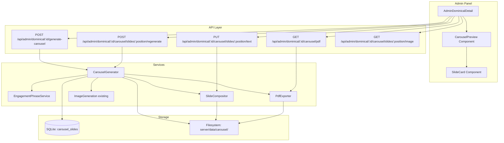

# Design Document: Dominical Carousel Images

## Overview

This feature replaces the single abstract cover image in the "El Dominical IA" weekly report with a multi-slide LinkedIn carousel. The system generates one slide per selected news article, plus a branded cover slide and a CTA slide. Each article slide composites an AI-generated background with the Robles.AI logo, article title, and a provocative engagement phrase. The final output is exportable as a PDF (LinkedIn carousel format) or as individual PNG images.

The design integrates into the existing dominical report system, extending the admin panel at `/admin/dominical/:id` with carousel management capabilities. It leverages the already-available `sharp` library for image composition, `OpenAI` client for AI generation (gpt-image-1 for images, gpt-4o for text), and `better-sqlite3` for persistence.

## Architecture



### Key Architectural Decisions

1. **File storage in `server/data/carousel/`** — Images persist in `server/data/carousel/{reportId}/` which survives builds (unlike `dist/`). The build step's `postbuild` script already copies `server/data/*` to `dist/data/`. Served via a static route.

2. **Sequential-with-concurrency generation** — Engagement phrases are generated in a single batch GPT-4o call. Background images use `Promise.allSettled` with a concurrency limit of 3 to avoid rate limits while keeping generation fast.

3. **PDFKit for PDF generation** — Lightweight, pure Node.js, no native dependencies. Each page is exactly 1080x1080 points with the slide image embedded full-bleed.

4. **SVG-based text rendering via Sharp** — Text is rendered as an SVG overlay composited onto the background with `sharp.composite()`. This avoids font dependency issues and gives precise control over positioning, gradients, and styling.

## Components and Interfaces

### CarouselGenerator Service (`server/services/carouselGenerator.ts`)

Orchestrates the full carousel generation pipeline.

```typescript
interface CarouselGenerationResult {
  reportId: number;
  slides: SlideResult[];
  errors: SlideError[];
}

interface SlideResult {
  position: number;
  type: 'cover' | 'article' | 'cta';
  status: 'generated' | 'failed';
  imagePath: string | null;
  articleSlug: string | null;
  titleText: string;
  engagementPhrase: string | null;
}

interface SlideError {
  position: number;
  error: string;
}

export async function generateCarousel(reportId: number): Promise<CarouselGenerationResult>;
export async function regenerateSlide(reportId: number, position: number): Promise<SlideResult>;
```

### EngagementPhraseService (`server/services/engagementPhrases.ts`)

Generates provocative engagement phrases via GPT-4o.

```typescript
interface ArticleInput {
  title: string;
  excerpt: string;
  categories: string[];
}

interface EngagementPhraseResult {
  phrases: string[];  // One per article, max 80 chars each
}

export async function generateEngagementPhrases(
  articles: ArticleInput[],
  apiKey: string
): Promise<EngagementPhraseResult>;
```

### SlideCompositor (`server/services/slideCompositor.ts`)

Handles image composition using Sharp.

```typescript
interface ComposeSlideOptions {
  backgroundImagePath: string;
  logoPath: string;
  titleText: string;
  engagementPhrase?: string;
  slideType: 'cover' | 'article' | 'cta';
  outputPath: string;
}

interface ComposeCoverOptions {
  backgroundImagePath: string;
  logoPath: string;
  weekStart: string;
  weekEnd: string;
  outputPath: string;
}

interface ComposeCTAOptions {
  backgroundImagePath: string;
  logoPath: string;
  ctaMessage: string;
  outputPath: string;
}

export async function composeArticleSlide(options: ComposeSlideOptions): Promise<void>;
export async function composeCoverSlide(options: ComposeCoverOptions): Promise<void>;
export async function composeCTASlide(options: ComposeCTAOptions): Promise<void>;
```

### PdfExporter (`server/services/pdfExporter.ts`)

Combines slides into a downloadable PDF.

```typescript
interface PdfExportResult {
  pdfBuffer: Buffer;
  pageCount: number;
  warnings: string[];  // e.g., "Slide 3 excluded: image missing"
}

export async function exportCarouselPdf(
  reportId: number,
  slidePaths: string[]
): Promise<PdfExportResult>;
```

### API Endpoints (added to `server/adminRoutes.ts`)

| Method | Path | Description |
|--------|------|-------------|
| POST | `/api/admin/dominical/:id/generate-carousel` | Generate full carousel for report |
| POST | `/api/admin/dominical/:id/carousel/slides/:position/regenerate` | Regenerate a single slide |
| PUT | `/api/admin/dominical/:id/carousel/slides/:position/text` | Update slide text and re-compose |
| GET | `/api/admin/dominical/:id/carousel/pdf` | Download carousel as PDF |
| GET | `/api/admin/dominical/:id/carousel/slides/:position/image` | Download individual slide PNG |
| GET | `/api/admin/dominical/:id/carousel` | Get carousel metadata/status |

### Frontend Components

**CarouselPreview** (`src/components/admin/CarouselPreview.tsx`)
- Horizontal scrollable container showing slide thumbnails
- Each slide shows status badge (pending/generated/failed)
- Click to view full size in modal
- "Generate Carousel" button triggers generation
- Per-slide "Regenerate" button

**SlideEditor** (`src/components/admin/SlideEditor.tsx`)
- Modal for editing individual slide text
- Shows current slide image as background
- Editable fields for title and engagement phrase
- "Re-compose" button to apply text changes

## Data Models

### Database Schema: `carousel_slides` table

```sql
CREATE TABLE IF NOT EXISTS carousel_slides (
  id INTEGER PRIMARY KEY AUTOINCREMENT,
  report_id INTEGER NOT NULL,
  position INTEGER NOT NULL,
  slide_type TEXT NOT NULL CHECK(slide_type IN ('cover', 'article', 'cta')),
  article_slug TEXT,
  title_text TEXT NOT NULL,
  engagement_phrase TEXT,
  background_image_path TEXT,
  composite_image_path TEXT,
  status TEXT NOT NULL DEFAULT 'pending' CHECK(status IN ('pending', 'generating', 'generated', 'failed')),
  error_message TEXT,
  created_at TEXT NOT NULL,
  updated_at TEXT,
  FOREIGN KEY (report_id) REFERENCES dominical_reports(id),
  UNIQUE(report_id, position)
);
```

### File Storage Structure

```
server/data/carousel/
  └── {reportId}/
      ├── backgrounds/
      │   ├── cover.png
      │   ├── slide-1.png
      │   ├── slide-2.png
      │   └── cta.png
      └── composites/
          ├── 00-cover.png
          ├── 01-slide.png
          ├── 02-slide.png
          └── 03-cta.png
```

- `backgrounds/` — Raw AI-generated images before text overlay
- `composites/` — Final slides with logo, text, and gradient

### Slide Composition Layout (1080x1080)

```
┌─────────────────────────────────┐
│  [Logo 120x120]     (top-left)  │
│                                 │
│                                 │
│                                 │
│  ┌─────────────────────────┐    │
│  │  Semi-transparent dark  │    │
│  │  gradient overlay       │    │
│  │                         │    │
│  │  Article Title          │    │
│  │  (32px, white, bold)    │    │
│  │                         │    │
│  │  Engagement Phrase      │    │
│  │  (24px, #93c5fd, italic)│    │
│  └─────────────────────────┘    │
└─────────────────────────────────┘
```

- Logo: positioned at top-left with 40px padding
- Text area: bottom third of image with gradient overlay (rgba(0,0,0,0.7) → transparent)
- Title: white, bold, max 2 lines with ellipsis
- Engagement phrase: light blue (#93c5fd), italic, below title

## Correctness Properties

*A property is a characteristic or behavior that should hold true across all valid executions of a system — essentially, a formal statement about what the system should do. Properties serve as the bridge between human-readable specifications and machine-verifiable correctness guarantees.*

### Property 1: Engagement phrase length constraint

*For any* article input (title, excerpt, categories), the generated engagement phrase SHALL be a non-empty string of 80 characters or fewer.

**Validates: Requirements 1.2**

### Property 2: Image prompt derivation completeness

*For any* article with a title and categories array, the generated image prompt SHALL contain at least one word from the title and reference the article's thematic domain.

**Validates: Requirements 2.1**

### Property 3: File path association with report ID

*For any* generated slide, its stored file path SHALL contain the report ID as a path component, and the file SHALL exist on disk at that path after generation completes successfully.

**Validates: Requirements 2.3**

### Property 4: Slide generation independence (error isolation)

*For any* set of N slides where K slides fail image generation (K < N), exactly N-K slides SHALL complete successfully with status 'generated', and the failed slides SHALL have status 'failed' without affecting the successful ones.

**Validates: Requirements 2.4**

### Property 5: All slides produce 1080x1080 PNG output

*For any* successfully composed slide (cover, article, or CTA), the output file SHALL be a valid PNG image with dimensions exactly 1080x1080 pixels.

**Validates: Requirements 3.5, 5.3, 7.2**

### Property 6: Carousel structural ordering

*For any* generated carousel with N articles, the carousel SHALL contain exactly N+2 slides, where position 0 is always a 'cover' type, positions 1 through N are 'article' type, and position N+1 is always a 'cta' type.

**Validates: Requirements 4.1, 5.1**

### Property 7: PDF page count matches valid slides

*For any* carousel with N total slides where all slides are valid, the exported PDF SHALL contain exactly N pages.

**Validates: Requirements 6.1**

### Property 8: PDF graceful degradation with missing slides

*For any* carousel where M slides have missing or corrupted images (M < total), the exported PDF SHALL contain exactly (total - M) pages and the result SHALL include exactly M warning messages.

**Validates: Requirements 6.4**

### Property 9: Slide regeneration isolation

*For any* carousel and any single slide at position P, regenerating that slide SHALL not modify the composite image files or database records of any slide at position != P.

**Validates: Requirements 9.1, 9.2**

### Property 10: Background preservation on text-only changes

*For any* article slide, when only the title or engagement phrase text is changed (without regeneration), the background image file SHALL remain byte-for-byte identical before and after re-composition.

**Validates: Requirements 10.3**

### Property 11: Carousel metadata round-trip with ordering

*For any* generated carousel, storing slide metadata to the database and then retrieving it SHALL produce the same ordered sequence of slides with identical position values, types, text content, and file paths.

**Validates: Requirements 11.1, 11.2**

## Error Handling

### AI Service Failures

| Scenario | Handling |
|----------|----------|
| GPT-4o engagement phrase failure | Retry once. On second failure, return error to admin with descriptive message. Carousel generation continues for slides that already have phrases. |
| gpt-image-1 image generation failure | Mark individual slide as 'failed' with error message. Continue generating remaining slides. Admin can retry failed slides individually. |
| Rate limiting (429) | Exponential backoff with max 3 retries per image. Reduce concurrency from 3 to 1 if multiple 429s detected. |

### File System Errors

| Scenario | Handling |
|----------|----------|
| Disk full / write error | Fail the specific slide, log error. Return partial success with error details. |
| Missing background for composition | Skip composition, mark slide as 'failed'. |
| Missing logo file | Fail all composition (critical dependency). Return clear error message. |

### PDF Export Errors

| Scenario | Handling |
|----------|----------|
| Some slides missing | Exclude missing slides, include warnings in response. |
| All slides missing | Return 400 error — "No valid slides available for PDF export". |
| PDFKit generation error | Return 500 with error details. |

### Database Errors

| Scenario | Handling |
|----------|----------|
| Unique constraint violation (duplicate position) | Use INSERT OR REPLACE to handle re-generation gracefully. |
| Foreign key violation (invalid report_id) | Return 404 — "Report not found". |

### Concurrency

- A generation-in-progress flag prevents duplicate carousel generation for the same report.
- Implemented via the `status` field on slides: if any slide for a report is 'generating', reject new generation requests with 409.

## Testing Strategy

### Property-Based Testing (fast-check)

The project already has `fast-check` as a devDependency and `vitest` as the test runner. Each correctness property above maps to a property-based test.

**Configuration:**
- Minimum 100 iterations per property test
- Tests run via `vitest --run`
- Tag format: `Feature: dominical-carousel-images, Property {N}: {description}`

**Property tests target:**
- `EngagementPhraseService` — phrase length constraint (P1)
- `CarouselGenerator` — ordering logic (P6), error isolation (P4), metadata round-trip (P11)
- `SlideCompositor` — output dimensions (P5), background preservation (P10)
- `PdfExporter` — page count (P7), graceful degradation (P8)
- File path logic — report ID association (P3)
- Regeneration — isolation (P9)

### Unit Tests (example-based)

- Cover slide contains "El Dominical IA" and date range text
- CTA slide contains call-to-action message
- Retry logic fires exactly once on GPT-4o failure
- API endpoints return correct status codes for various scenarios
- Image prompt includes article title keywords
- SVG text generation handles special characters (quotes, accents, ampersands)
- Status transitions (pending → generating → generated/failed)

### Integration Tests

- Full carousel generation with mocked OpenAI API
- PDF export endpoint returns valid PDF buffer
- Slide image endpoint returns correct content-type and dimensions
- Database persistence survives server restart (read after write)
- Admin panel correctly displays carousel state from API

### What Is NOT Property-Tested

- UI rendering and layout (use visual inspection + snapshot tests)
- OpenAI API behavior (mocked in property tests, tested end-to-end manually)
- Spanish language quality of engagement phrases (manual review)
- Visual aesthetics of composed slides (manual review)
