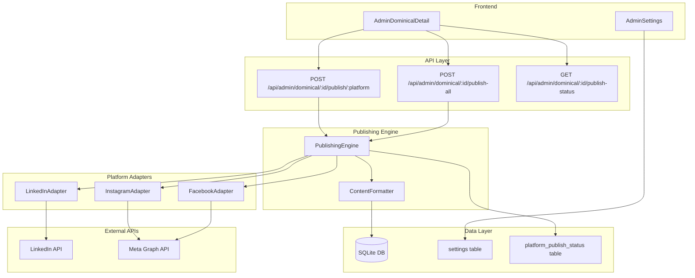

# Design Document: Multi-Platform Publishing

## Overview

This feature extends El Dominical IA's publishing capability from LinkedIn-only to multi-platform (LinkedIn, Instagram, Facebook). Each platform maintains an independent publish lifecycle, allowing the admin to publish selectively and at different times. The system adapts content format per platform: PDF carousel for LinkedIn, multi-image carousel for Instagram, and multi-photo post for Facebook.

The architecture uses a **platform adapter pattern** where each social platform has a dedicated adapter implementing a common interface. A central publishing engine orchestrates platform-specific formatting and publishing, while a new `platform_publish_status` table tracks independent per-platform statuses.

## Architecture



### Key Design Decisions

1. **New table instead of columns on `dominical_reports`**: A separate `platform_publish_status` table provides clean normalization, extensibility for future platforms, and eliminates the need to alter the existing table structure beyond removing the now-deprecated single `status`/`linkedin_post_id` columns.

2. **Adapter pattern over monolithic service**: Each platform adapter encapsulates its own API protocol, retry logic, and token management. This keeps each adapter testable in isolation and allows adding platforms without modifying the core engine.

3. **Publicly accessible image URLs for Meta APIs**: Both Instagram and Facebook Graph APIs require images to be hosted at publicly accessible URLs. The system will serve carousel slide images via a public endpoint (`/api/public/slides/:reportId/:position`) that the Meta APIs can cURL during the publish flow.

4. **Content formatting as a pure function layer**: The `ContentFormatter` module performs text truncation, hashtag preservation, and format selection as pure functions — making them testable with property-based testing without needing external service mocks.

## Components and Interfaces

### 1. Platform Adapter Interface

```typescript
// server/services/platforms/types.ts

export type PlatformName = 'linkedin' | 'instagram' | 'facebook';

export type PlatformStatus = 'not_published' | 'publishing' | 'published' | 'failed';

export interface PublishRequest {
  reportId: number;
  text: string;
  slideImageUrls: string[];  // Publicly accessible URLs for each slide PNG
  coverImageUrl?: string;    // Fallback cover image
  pdfBuffer?: Buffer;        // Pre-generated PDF (for LinkedIn)
}

export interface PublishResult {
  success: boolean;
  platformPostId?: string;   // Platform-specific post ID/URN
  error?: string;
}

export interface PlatformAdapter {
  readonly platform: PlatformName;
  
  /** Check if this platform has valid credentials configured */
  hasCredentials(): boolean;
  
  /** Publish content to the platform */
  publish(request: PublishRequest): Promise<PublishResult>;
  
  /** Validate stored credentials (test API call) */
  validateCredentials(): Promise<{ valid: boolean; error?: string }>;
}
```

### 2. Publishing Engine

```typescript
// server/services/platforms/publishingEngine.ts

export interface PlatformPublishStatus {
  reportId: number;
  platform: PlatformName;
  status: PlatformStatus;
  platformPostId: string | null;
  errorMessage: string | null;
  publishedAt: string | null;
}

export class PublishingEngine {
  /** Publish to a single platform */
  publishToPlatform(reportId: number, platform: PlatformName): Promise<PublishResult>;
  
  /** Publish to all eligible platforms (not_published + has credentials) */
  publishToAll(reportId: number): Promise<Map<PlatformName, PublishResult>>;
  
  /** Get current status for all platforms for a report */
  getStatuses(reportId: number): PlatformPublishStatus[];
  
  /** Initialize statuses for a new report */
  initializeStatuses(reportId: number): void;
}
```

### 3. Content Formatter

```typescript
// server/services/platforms/contentFormatter.ts

export interface FormattedContent {
  text: string;           // Truncated/adapted text
  mediaType: 'carousel_pdf' | 'multi_image' | 'single_image' | 'text_only';
  mediaUrls: string[];    // Image URLs to attach
  pdfBuffer?: Buffer;     // PDF buffer for LinkedIn carousel
}

export function formatForPlatform(
  platform: PlatformName,
  rawText: string,
  slideImageUrls: string[],
  pdfBuffer?: Buffer,
  coverImageUrl?: string
): FormattedContent;

export function truncateText(
  text: string,
  maxLength: number
): string;

export function extractHashtagsAndMentions(
  text: string
): { body: string; hashtags: string[]; mentions: string[] };
```

### 4. API Endpoints

| Method | Path | Description |
|--------|------|-------------|
| GET | `/api/admin/dominical/:id/publish-status` | Get all platform statuses for a report |
| POST | `/api/admin/dominical/:id/publish/:platform` | Publish to a specific platform |
| POST | `/api/admin/dominical/:id/publish-all` | Publish to all eligible platforms |
| GET | `/api/public/slides/:reportId/:position` | Public image endpoint for Meta API access |

### 5. Instagram Adapter

The Instagram adapter uses the [Instagram Graph API Content Publishing](https://developers.facebook.com/docs/instagram-platform/instagram-graph-api/content-publishing) flow:

1. **Create item containers**: For each slide image, POST to `/{ig-user-id}/media` with `image_url` and `is_carousel_item=true`
2. **Create carousel container**: POST to `/{ig-user-id}/media` with `media_type=CAROUSEL` and `children` referencing item container IDs
3. **Publish**: POST to `/{ig-user-id}/media_publish` with `creation_id` set to the carousel container ID

Key constraints:
- Maximum 10 images per carousel
- Images must be publicly accessible URLs (Meta servers cURL them)
- JPEG format required (the adapter will convert PNG to JPEG before uploading)
- Rate limit: 50 API-published posts per 24 hours
- Requires `instagram_content_publish` permission

### 6. Facebook Adapter

The Facebook adapter uses the [Graph API Page Feed](https://developers.facebook.com/docs/graph-api/reference/page/feed/) with multi-photo posts:

1. **Upload photos unpublished**: For each slide image, POST to `/{page-id}/photos` with `published=false` and `url` pointing to the image
2. **Create multi-photo post**: POST to `/{page-id}/feed` with `message` (post text) and `attached_media` array referencing the unpublished photo IDs

Key constraints:
- Each photo uploaded individually in unpublished state
- Post created referencing photo IDs via `attached_media[i]={media_fbid: id}`
- Character limit: 63,206 characters
- Requires `pages_manage_posts` permission and Page access token

### 7. Token Management

Both Instagram and Facebook use long-lived Page Access Tokens obtained through the Meta OAuth flow:

- **Short-lived token** (1 hour): Obtained during initial OAuth
- **Long-lived user token** (~60 days): Exchanged from short-lived token via `GET /oauth/access_token?grant_type=fb_exchange_token`
- **Page access token** (never expires when derived from long-lived user token): Obtained via `GET /{user-id}/accounts`

The system stores the long-lived Page access token. On token errors (401/403), it attempts one refresh using the stored app credentials before marking the publish as failed. For production use, a System User token from Business Manager is recommended as it doesn't expire.

## Data Models

### New Table: `platform_publish_status`

```sql
CREATE TABLE IF NOT EXISTS platform_publish_status (
  id INTEGER PRIMARY KEY AUTOINCREMENT,
  report_id INTEGER NOT NULL,
  platform TEXT NOT NULL CHECK(platform IN ('linkedin', 'instagram', 'facebook')),
  status TEXT NOT NULL DEFAULT 'not_published' 
    CHECK(status IN ('not_published', 'publishing', 'published', 'failed')),
  platform_post_id TEXT,
  error_message TEXT,
  published_at TEXT,
  created_at TEXT NOT NULL,
  updated_at TEXT,
  FOREIGN KEY (report_id) REFERENCES dominical_reports(id),
  UNIQUE(report_id, platform)
);
```

### Settings Keys (new)

| Key | Description |
|-----|-------------|
| `meta_app_id` | Meta/Facebook App ID |
| `meta_app_secret` | Meta/Facebook App Secret |
| `instagram_business_account_id` | Instagram Business/Professional account ID |
| `instagram_access_token` | Long-lived token for Instagram publishing |
| `facebook_page_id` | Facebook Page ID to publish to |
| `facebook_page_access_token` | Page access token for Facebook publishing |
| `meta_token_expires_at` | Token expiry timestamp |

### Migration Strategy

The existing `dominical_reports.status` and `linkedin_post_id` columns remain for backward compatibility during transition. The new `platform_publish_status` table is the source of truth for publish status going forward. A migration script will:

1. Create the new `platform_publish_status` table
2. For existing reports with `status = 'published'`, insert a row with `platform = 'linkedin'`, `status = 'published'`, and `platform_post_id = linkedin_post_id`
3. For all reports, ensure all three platform rows exist (initialize missing ones as `not_published`)

The existing publish endpoint behavior is preserved — it will continue to work via the LinkedIn adapter — while new platform-specific endpoints are added alongside it.

## Correctness Properties

*A property is a characteristic or behavior that should hold true across all valid executions of a system — essentially, a formal statement about what the system should do. Properties serve as the bridge between human-readable specifications and machine-verifiable correctness guarantees.*

### Property 1: Platform Status Initialization Invariant

*For any* newly created Dominical Report, the `platform_publish_status` table SHALL contain exactly 3 rows (one for each platform: linkedin, instagram, facebook), all with status `not_published`.

**Validates: Requirements 1.1, 1.2**

### Property 2: Publish Operation Isolation

*For any* report and any platform P, when a publish operation to P completes (either success or failure), the status of all other platforms for that report SHALL remain unchanged from their values before the operation began.

**Validates: Requirements 1.3, 1.4**

### Property 3: Post ID Storage on Success

*For any* platform and any report, if a publish operation returns a successful result with a platform post ID, then querying the `platform_publish_status` for that report and platform SHALL return status `published` and the same platform post ID.

**Validates: Requirements 1.5, 3.5, 4.5**

### Property 4: Text Truncation Respects Platform Limits

*For any* string of arbitrary length and any platform with character limit L, `truncateText(text, L)` SHALL produce output with length ≤ L that ends at a complete sentence boundary (period, exclamation mark, or question mark followed by whitespace or end-of-string), unless no sentence boundary exists within the limit (in which case it truncates at a word boundary with ellipsis).

**Validates: Requirements 2.4**

### Property 5: Hashtag and Mention Preservation During Truncation

*For any* text containing hashtags (#word) and mentions (@word), after truncation the output text SHALL contain all hashtags and mentions present in the original text, appended at the end if they were in the truncated portion.

**Validates: Requirements 2.5**

### Property 6: Format Selection by Slide Count

*For any* report with N carousel slides, `formatForPlatform('linkedin', ...)` SHALL select `carousel_pdf` media type when N ≥ 2, and `single_image` or `text_only` when N < 2.

**Validates: Requirements 2.1**

### Property 7: Auto-Publish Platform Selection and Independence

*For any* set of platform credential configurations and platform statuses, auto-publish SHALL attempt publication only to platforms where `hasCredentials() === true` AND `status === 'not_published'`. Furthermore, *for any* platform failure during auto-publish, all other eligible platforms SHALL still be attempted.

**Validates: Requirements 7.1, 7.2**

## Error Handling

### Platform-Level Errors

| Error Category | Handling Strategy |
|---------------|-------------------|
| **Token expired (401/403)** | Attempt token refresh once, retry the operation. If refresh fails, mark as `failed` with descriptive error. |
| **Rate limit exceeded (429)** | Mark as `failed` with message indicating rate limit. Do not retry automatically. |
| **Image upload failure** | Mark as `failed` with the specific image position that failed. Allow retry. |
| **Network timeout** | Mark as `failed` with timeout error. Allow retry. |
| **Invalid credentials** | Mark as `failed` with "credentials invalid" message. Prompt admin to reconfigure in settings. |

### Error Isolation

Each platform's publish operation is wrapped in a try/catch. A failure on one platform MUST NOT prevent attempts to other platforms (especially important for the "Publish to All" and auto-publish flows).

### Error Messages

Error messages stored in `platform_publish_status.error_message` should be user-friendly and actionable:
- Include the platform name
- Include what step failed (e.g., "image upload", "carousel creation", "post publish")
- Include the HTTP status code if available
- Suggest next steps (e.g., "Check credentials in Settings")

### Retry Logic

- Each adapter implements a single retry with token refresh on auth errors
- The admin can manually retry any failed platform via the UI
- Auto-publish does NOT auto-retry — it reports failures in the notification email

## Testing Strategy

### Property-Based Tests (fast-check)

The project already uses `fast-check` (v4.9.0) as a dev dependency with `vitest` as the test runner. Property-based tests will target the pure logic layer:

- **ContentFormatter tests**: Text truncation, hashtag preservation, format selection
- **PublishingEngine state tests**: Status initialization, isolation, post ID storage
- **Auto-publish selection logic**: Correct platform filtering

Each property test will run a minimum of 100 iterations and reference its design document property with a tag comment:
```
// Feature: multi-platform-publishing, Property 4: Text truncation respects platform limits
```

### Unit Tests (vitest)

- Platform adapter API call sequences (with mocked HTTP)
- Token refresh retry logic
- Edge cases: 0 slides, 1 slide, 10+ slides (Instagram max)
- Error message formatting
- Settings CRUD for new credential keys

### Integration Tests

- Full publish flow for each platform with mocked Meta Graph API responses
- Auto-publish cron trigger with mixed credential/status configurations
- Database migration script correctness
- Public slide image endpoint accessibility

### Frontend Tests

- Component rendering for multi-platform status badges
- Button enable/disable logic based on platform status and credentials
- "Publish to All" triggers correct set of API calls
- Loading states during publish operations
