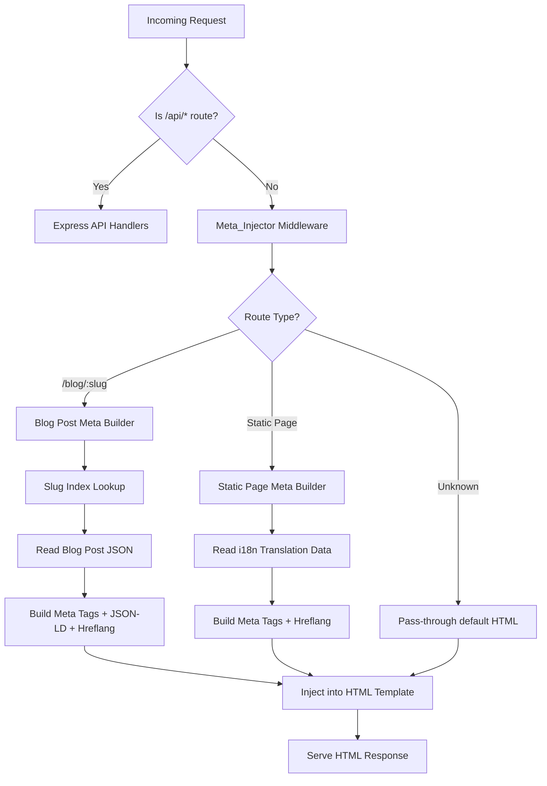

# Design Document: SEO Improvements

## Overview

This design implements server-side HTML meta tag injection for the Robles.AI website to make blog post metadata, structured data, and hreflang tags visible to search engine crawlers without executing JavaScript. The site is a React SPA with 800+ auto-generated bilingual blog posts (EN/ES) served by Express.

The core approach is an Express middleware (Meta_Injector) that intercepts requests for known routes, reads the `index.html` template, injects appropriate `<head>` content (meta tags, JSON-LD, hreflang links), and serves the modified HTML. This provides crawler-visible metadata while preserving the existing client-side SPA behavior.

### Key Design Decisions

1. **Middleware placement**: The Meta_Injector runs as a catch-all handler registered *after* API routes but *before* the Vite dev middleware or static file serving. This ensures API routes are unaffected while HTML responses get injected meta tags.

2. **Slug-to-file resolution**: A build-time index maps slugs to file paths, cached in memory with lazy loading. This avoids scanning the filesystem on every request.

3. **Template caching**: In production, the built `index.html` is read once and cached. In development, it's re-read per request (matching current Vite behavior) and passed through Vite's `transformIndexHtml`.

4. **Sitemap consolidation**: Monthly sitemaps are consolidated from separate per-language files into a single file per month with `xhtml:link` hreflang annotations, following Google's sitemap hreflang guidelines.

## Architecture



### Request Flow

1. Request arrives at Express
2. Logging middleware and JSON parsing run
3. API routes (`/api/*`, `/sitemap.xml`, `/sitemaps/*`) handled by `registerRoutes`
4. **Meta_Injector middleware** catches remaining requests:
   - Identifies route type (blog post, static page, or unknown)
   - Resolves metadata from blog post JSON or i18n translations
   - Reads HTML template (dev: from source + Vite transform, prod: from dist/)
   - Performs string replacements in `<head>` to inject/replace meta tags
   - Serves the modified HTML
5. If Meta_Injector cannot resolve metadata (unknown route, missing post), it serves the default template unmodified

## Components and Interfaces

### 1. MetaInjector Middleware

**File**: `server/metaInjector.ts`

```typescript
interface MetaInjectorConfig {
  mode: 'development' | 'production';
  distPath: string;          // Path to built dist/ directory
  sourcePath: string;        // Path to source index.html  
  viteTransform?: (url: string, html: string) => Promise<string>;
}

interface PageMeta {
  title: string;
  description: string;
  ogTitle: string;
  ogDescription: string;
  ogUrl: string;
  ogType: string;       // "article" for blog, "website" for static
  ogImage: string;
  twitterCard: string;  // "summary_large_image"
  twitterTitle: string;
  twitterDescription: string;
  twitterImage: string;
  canonicalUrl: string;
  hreflangLinks: HreflangLink[];
  jsonLd?: object[];    // Array of JSON-LD objects to inject
}

interface HreflangLink {
  hreflang: string;  // "en", "es", "x-default"
  href: string;
}

// Main middleware factory
export function createMetaInjector(config: MetaInjectorConfig): RequestHandler;
```

**Responsibilities**:
- Read and cache the HTML template
- Route matching (blog vs static vs unknown)
- Delegate metadata resolution to specialized builders
- String replacement in HTML `<head>`
- Return modified HTML response

### 2. SlugIndex

**File**: `server/slugIndex.ts`

```typescript
interface SlugIndexEntry {
  filePath: string;       // Absolute path to JSON file
  enSlug: string;
  esSlug: string;
  date: string;           // "YYYY-MM-DD"
}

interface SlugIndex {
  get(slug: string): SlugIndexEntry | undefined;
  rebuild(): Promise<void>;
  addEntry(entry: SlugIndexEntry): void;
}

export function createSlugIndex(postsDir: string): SlugIndex;
```

**Responsibilities**:
- On first request (lazy init), scans `server/data/posts/` recursively
- Builds a `Map<string, SlugIndexEntry>` keyed by both EN and ES slugs
- Provides O(1) lookup from any slug to its file path and sibling slug
- Exposes `addEntry()` for the cron job to register new posts without full rebuild

### 3. BlogMetaBuilder

**File**: `server/metaBuilders.ts`

```typescript
interface BlogMetaBuilderInput {
  post: BlogPostData;
  lang: 'en' | 'es';
  slug: string;
}

export function buildBlogMeta(input: BlogMetaBuilderInput): PageMeta;
export function buildBlogJsonLd(input: BlogMetaBuilderInput, editorName: string): object[];
```

**Responsibilities**:
- Construct `PageMeta` from blog post JSON data
- Truncate description to 160 characters
- Build BlogPosting JSON-LD schema
- Build BreadcrumbList JSON-LD schema
- Determine canonical URL (slug without query params)

### 4. StaticMetaBuilder

**File**: `server/metaBuilders.ts`

```typescript
interface StaticPageConfig {
  path: string;
  i18nKey: string;  // Key in the seo.* translations
}

export function buildStaticMeta(
  pagePath: string, 
  lang: 'en' | 'es', 
  translations: Record<string, any>
): PageMeta;

export function buildHomeJsonLd(): object[];
```

**Responsibilities**:
- Map route path to i18n key
- Read title/description from translation data
- Build WebSite JSON-LD for home page
- Build hreflang links for static pages (EN base URL, ES with `?lang=es`)

### 5. HtmlInjector

**File**: `server/htmlInjector.ts`

```typescript
export function injectMeta(html: string, meta: PageMeta): string;
```

**Responsibilities**:
- Replace `<title>...</title>` content
- Replace or insert `<meta name="description">` content
- Replace or insert Open Graph meta tags
- Replace or insert Twitter Card meta tags
- Remove existing canonical/alternate link tags
- Insert new canonical and hreflang link tags
- Insert JSON-LD script blocks (preserving existing Organization schema)
- Guarantee no modification to `<body>` content

### 6. Enhanced Sitemap Generator

**File**: `src/scripts/sitemapService.ts` (modified)

```typescript
// Updated signature - now generates consolidated sitemaps with hreflang
export async function updateSitemap(
  enSlug: string, 
  esSlug: string, 
  date: string
): Promise<void>;
```

**Responsibilities**:
- Generate one sitemap XML file per month (e.g., `2025-05.xml`)
- Include `xhtml:link` alternate entries for each URL
- Declare `xmlns:xhtml` namespace
- Use clean URLs without `?lang=` parameters

## Data Models

### Blog Post JSON (existing, unchanged)

```typescript
interface BlogPostData {
  slug: string;              // Base slug (date-prefixed)
  date: string;              // "YYYY-MM-DD"
  image?: string;
  editorId: number;
  categories: string[];
  keywords: string[];
  translations: {
    en: BlogTranslation;
    es: BlogTranslation;
  };
  sources: { title: string; url: string; source: string }[];
}

interface BlogTranslation {
  slug: string;              // Language-specific slug
  title: string;
  excerpt: string;
  content: { heading: string; body: string }[];
}
```

### PageMeta (new)

```typescript
interface PageMeta {
  title: string;
  description: string;        // Max 160 chars
  ogTitle: string;
  ogDescription: string;
  ogUrl: string;
  ogType: 'article' | 'website';
  ogImage: string;
  twitterCard: 'summary_large_image';
  twitterTitle: string;
  twitterDescription: string;
  twitterImage: string;
  canonicalUrl: string;
  hreflangLinks: HreflangLink[];
  jsonLd?: object[];
}
```

### Static Page Registry (new)

```typescript
const STATIC_PAGES: Record<string, string> = {
  '/': 'home',
  '/blog': 'blog',
  '/careers': 'careers',
  '/get-started': 'landing',
  '/apply': 'apply',
};
```

### Sitemap Entry with Hreflang (new format)

```xml
<url>
  <loc>https://robles.ai/blog/2025-03-28-00-00-00-embracing-the-future-edge-ai-and-net-zero-infrastructure</loc>
  <xhtml:link rel="alternate" hreflang="en" href="https://robles.ai/blog/2025-03-28-00-00-00-embracing-the-future-edge-ai-and-net-zero-infrastructure"/>
  <xhtml:link rel="alternate" hreflang="es" href="https://robles.ai/blog/2025-03-28-00-00-00-abrazando-el-futuro-ia-en-el-borde-e-infraestructura-net-zero"/>
  <changefreq>weekly</changefreq>
  <priority>0.8</priority>
</url>
```

## Correctness Properties

*A property is a characteristic or behavior that should hold true across all valid executions of a system — essentially, a formal statement about what the system should do. Properties serve as the bridge between human-readable specifications and machine-verifiable correctness guarantees.*

### Property 1: Blog meta injection round-trip

*For any* valid Blog_Post JSON file and any language (en/es), when the Meta_Injector processes a request for that post's slug, the resulting HTML SHALL contain a `<title>` element whose text content exactly matches the post's title in the resolved language.

**Validates: Requirements 1.1, 1.5, 1.6**

### Property 2: Description truncation invariant

*For any* blog post excerpt of any length, the injected `<meta name="description">` content SHALL have a length of at most 160 characters.

**Validates: Requirements 1.2**

### Property 3: Open Graph completeness for blog posts

*For any* valid Blog_Post JSON, the injected HTML SHALL contain all five required Open Graph tags (`og:title`, `og:description`, `og:url`, `og:type`, `og:image`) with non-empty content attributes.

**Validates: Requirements 1.3**

### Property 4: Language resolution from slug

*For any* blog post with distinct EN and ES slugs, requesting the ES slug (without `?lang` param) SHALL produce meta tags using the Spanish translation fields, and requesting the EN slug SHALL produce meta tags using the English translation fields.

**Validates: Requirements 1.6**

### Property 5: Missing post preserves default HTML

*For any* slug that does not correspond to an existing Blog_Post, the response HTML body content and script references SHALL be identical to the unmodified template.

**Validates: Requirements 1.7, 1.8**

### Property 6: Body content preservation

*For any* request processed by the Meta_Injector, the `<body>` element and all its contents (including script tags within body) SHALL be byte-identical to the original template's body.

**Validates: Requirements 1.8, 9.1**

### Property 7: Hreflang symmetry for blog posts

*For any* blog post with both EN and ES translations, the injected HTML SHALL contain exactly three alternate link tags (hreflang="en", hreflang="es", hreflang="x-default") with correct URLs pointing to the respective slugs.

**Validates: Requirements 5.1, 5.2, 5.3**

### Property 8: Canonical URL is clean (no query parameters)

*For any* blog post request, the injected canonical link tag's `href` attribute SHALL NOT contain any query parameters.

**Validates: Requirements 5.4**

### Property 9: JSON-LD BlogPosting schema completeness

*For any* blog post, the injected JSON-LD SHALL parse as valid JSON and contain `@type: "BlogPosting"` with all required properties: `headline`, `description`, `datePublished`, `author`, `publisher`, `image`, and `mainEntityOfPage`.

**Validates: Requirements 3.1, 3.2**

### Property 10: Sitemap hreflang pairing

*For any* blog post entry in a monthly sitemap, there SHALL exist exactly two `xhtml:link` elements (one for EN, one for ES) referencing the correct slugs for that post.

**Validates: Requirements 7.1**

### Property 11: Static page meta uses correct i18n key

*For any* known static page path and language, the injected title SHALL exactly match the value at `seo.{routeKey}.title` in the corresponding language's i18n translation data.

**Validates: Requirements 2.1, 2.2, 2.3, 2.4, 2.5**

## Error Handling

| Scenario | Behavior |
|----------|----------|
| Blog post JSON file not found | Serve default `index.html` unmodified (client handles 404) |
| Blog post JSON malformed/unparseable | Log error, serve default `index.html` unmodified |
| Slug matches date pattern but no file exists | Serve default `index.html` unmodified |
| i18n translation file missing key | Fall back to English; if English also missing, use values from `index.html` template |
| `index.html` template read fails (production) | Return 500 error with generic message, log critical error |
| `index.html` template read fails (development) | Let Vite error handler propagate the error |
| SlugIndex initialization fails | Log error, Meta_Injector serves default HTML for all blog routes until index rebuilds |
| Invalid `?lang` parameter value | Ignore it; resolve language from slug matching (same as no `lang` param) |

## Testing Strategy

### Property-Based Testing

This feature is well-suited for property-based testing because:
- The Meta_Injector is a pure transformation: input (HTML template + metadata) → output (modified HTML)
- The metadata builders are pure functions: input (blog post JSON + lang) → output (PageMeta)
- There are clear universal invariants (description length, tag completeness, hreflang symmetry)

**Library**: [fast-check](https://github.com/dubzzz/fast-check) (TypeScript property-based testing)

**Configuration**: Minimum 100 iterations per property test.

**Tag format**: `Feature: seo-improvements, Property {N}: {title}`

Each correctness property above maps to one property-based test:
- Generate random blog post data (varying title lengths, excerpt lengths, slug formats, languages)
- Verify the output HTML maintains all invariants

### Unit Tests

- `HtmlInjector`: specific examples of HTML templates with varying existing meta tags
- `SlugIndex`: lookup by EN slug, ES slug, non-existent slug
- `BlogMetaBuilder`: edge cases (empty excerpt, very long title, special characters in title)
- `StaticMetaBuilder`: each static page with each language
- JSON-LD schema validation against schema.org spec

### Integration Tests

- Full request cycle in Express: request `/blog/:slug` → verify response HTML headers and meta content
- Dev mode: verify Vite transform is applied to the injected HTML
- Production mode: verify static file serving with meta injection
- Sitemap endpoint: verify XML output contains hreflang annotations
- Cron job: verify new posts are added to slug index and sitemap
