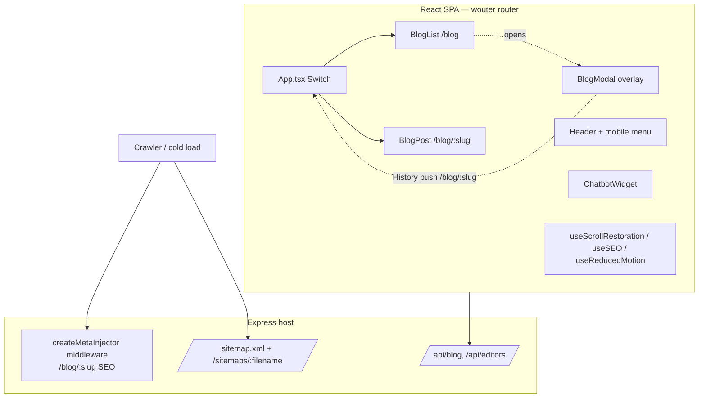

# Design Document — UX Overhaul

## Overview

This design turns the three confirmed areas of the `ux-overhaul` requirements — (1) responsive/mobile audit and fix, (2) a news/blog in-page modal viewer, and (3) cross-cutting accessibility/motion/loading improvements — into concrete, implementation-ready changes grounded in the actual `robles.ai` SPA (Vite + React 19 + TypeScript + Tailwind + Radix/shadcn + framer-motion + wouter + i18next).

The guiding principle is **surgical and pattern-reusing, not a rewrite**:

- **Reuse what exists.** The modal reuses the interaction pattern already proven in `src/components/VideoModal.tsx` (framer-motion `AnimatePresence`, Escape handler, `document.body.style.overflow` lock). The demo two-column layouts already use `grid grid-cols-1 lg:grid-cols-N`, so most demo responsiveness is a matter of confirming/completing that pattern rather than inventing one. Scroll behavior stays owned by the existing `src/hooks/useScrollRestoration.ts`. (Requirement 25.1, 25.3)
- **Prefer shared primitives over per-file ad-hoc fixes.** Where a fix repeats across many files (overflow guards, focus-visible styling, reduced-motion gating, tap-target sizing, scroll containers), we add a small set of **global CSS rules** (in `src/index.css`) and **one hook** (`useReducedMotion`) rather than editing dozens of files by hand. Per-file edits are reserved for genuinely local problems (a specific fixed-width element, a specific missing `aria-label`).
- **No new dependencies.** Everything is achievable with the current stack: Tailwind utilities, plain CSS media queries, the Web `matchMedia` API, the History API (already used by wouter), and framer-motion. No new UI or animation library is introduced. (Requirement 25.1, 25.2)
- **Do not regress SEO, sitemaps, or the chatbot.** The blog modal only pushes client-side History entries; the server-side `createMetaInjector` middleware (`server/seo/metaInjector.ts`) and the `/sitemap.xml` + `/sitemaps/:filename` routes (`server/routes.ts`) are independent of client routing and are left untouched. (Requirement 13.2, 13.3, 27.1, 27.2, 27.3)

### Approach per area

| Area | Strategy | Primary artifacts |
|------|----------|-------------------|
| 1 — Responsive | Global overflow guard + shared utility classes + targeted per-page edits; fixed-header offset centralized | `src/index.css`, `Header.tsx`, `Footer.tsx`, `ChatbotWidget.tsx`, `App.tsx`, forms, demo pages, admin pages |
| 2 — Blog modal | New `BlogModal` component (VideoModal pattern) + `useBlogModalRouting` hook; `BlogList` intercepts card clicks; `App.tsx` keeps `/blog/:slug` route for cold loads | `src/components/BlogModal.tsx`, `src/hooks/useBlogModalRouting.ts`, `BlogList.tsx`, `App.tsx` |
| 3 — Cross-cutting | Global focus-visible CSS, `useReducedMotion` hook gating animations, image lazy-load + aspect-ratio convention, consistent state components, ARIA/landmarks | `src/index.css`, `src/hooks/useReducedMotion.ts`, `Hero.tsx`/`ParticleBackground.tsx`/`ChatbotWidget.tsx`, `App.tsx`, various |

---

## Architecture

### System context (unchanged pieces)



The blog modal lives **entirely on the client**. When it opens it pushes a `/blog/:slug` History entry, but the `/blog` `BlogList` component stays mounted underneath. The server-side `MetaInjector` and sitemaps only ever run for **full HTTP requests** (cold loads / crawlers), which continue to hit the real `/blog/:slug` route and render `BlogPost`. This separation is what makes the modal safe for SEO. (Requirement 13.1, 13.2, 27.1)

### Client routing model for the blog modal

`App.tsx` today has both `<Route path="/blog" component={BlogList} />` and `<Route path="/blog/:slug" component={BlogPost} />` inside a wouter `<Switch>`. Because `<Switch>` renders the **first** match, a `/blog/:slug` URL renders `BlogPost` — this is exactly the cold-load fallback we want and it is **kept as-is**.

The modal is layered on top without changing the `<Switch>`:

- On `/blog`, `BlogList` renders normally. Clicking a `Blog_Card` does **not** navigate; it calls the modal open handler, which sets modal state and calls `history.pushState` for `/blog/:slug` (via a small routing hook, see Components). Because the URL change is a `pushState` that `BlogList` itself initiated and interprets, we do **not** let wouter swap the route to `BlogPost`; the list stays mounted and the modal renders above it.
- Closing the modal calls `history.back()` (if the modal owns the top entry) or `history.pushState` back to `/blog`, restoring the list URL with no full navigation.
- A **cold load** of `/blog/:slug` (no prior `/blog` list state) never reaches `BlogList`; wouter matches `/blog/:slug` and renders the full `BlogPost` page. (Requirement 13.1)

The mechanism that keeps the list mounted while the address bar shows `/blog/:slug` is a **modal-owned History layer** implemented in `useBlogModalRouting` (detailed below), rather than driving the modal purely off wouter's `location`. This avoids fighting the `<Switch>` and keeps `BlogPost` as the untouched cold-load target.

---

## Components and Interfaces

### Area 1 — Responsive strategy

#### 1a. Global overflow guard (shared)

A single CSS rule set in `src/index.css` prevents document-root horizontal overflow site-wide, so no page can produce a sideways scrollbar even if one child misbehaves. (Requirement 1.1, 1.2, 1.3, 1.4)

```css
html, body { max-width: 100%; overflow-x: hidden; }
/* Long unbreakable strings (URLs, tokens, hashes) never force overflow */
.break-anywhere { overflow-wrap: anywhere; word-break: break-word; }
```

`overflow-x: hidden` on the root is the safety net; it is **not** a substitute for fixing the actual offending element, because hiding overflow can clip content. Each real offender (a fixed-width block, a `w-[...px]`, a wide flex row) is still corrected at its source so content is confined to a **scrollable** region rather than clipped, per Requirement 1.5. The guard exists to guarantee the acceptance criterion even if an offender is missed.

#### 1b. Shared utility conventions (Tailwind + CSS)

Rather than bespoke fixes, we standardize a small vocabulary applied consistently:

- **Scrollable wide content** (tables, API logs, JSON, transcripts, charts): wrap in a container with `min-w-0 overflow-x-auto` (and the existing `.scrollbar-thin` utility already defined in `index.css`). The parent grid/flex cell gets `min-w-0` so the child can shrink instead of pushing the layout wide. (Requirement 1.5, 8.1, 8.2, 8.3, 23.4)
- **Tap targets**: a `.tap-target` utility (`min-height:44px; min-width:44px;` with centered content) for icon-only controls that are currently smaller than 44px (e.g. Footer social icons, BlogList filter chevrons, chatbot dismiss X). (Requirement 3.1, 3.2, 5.2, 7.3, 23.2)
- **Form inputs**: enforce `font-size: 16px` minimum on inputs/selects/textarea at mobile widths via a base rule, so iOS Safari does not auto-zoom on focus. Fields use `w-full` and forms use `min-w-0`. (Requirement 7.1, 7.2)
- **Media**: images get `max-w-full h-auto`; the demo canvas/media stages already use the "shrink-wrap + `max-w-full`, canvas `absolute inset-0 h-full w-full`" pattern (confirmed in `TryObjectDetection.tsx`), which we preserve and replicate where missing. (Requirement 9.1, 9.2, 9.3)

```css
@layer utilities {
  .tap-target { min-width: 44px; min-height: 44px; display: inline-flex;
    align-items: center; justify-content: center; }
}
@media (max-width: 767px) {
  input:not([type=checkbox]):not([type=radio]), select, textarea { font-size: 16px; }
}
```

#### 1c. Fixed-header offset and anchor scroll (centralized)

`App.tsx` already reserves header height with `<main className="flex-grow pt-[68px]">`, and `Header` is `fixed ... h ~68px`. Two gaps to close:

- **Anchor targets hidden under the header.** The site scrolls anchors with a hardcoded `-80` offset in `Home.tsx` and uses `scroll-mt-20` in `BlogPost`. We standardize on a CSS `scroll-margin-top` applied globally to anchor targets so any `#id` navigation lands below the fixed header. (Requirement 10.1, 10.2)

```css
:target { scroll-margin-top: 84px; }
[id] { scroll-margin-top: 84px; } /* headings/sections used as anchor targets */
```

- **Header height as a token.** Replace the magic numbers (`pt-[68px]`, `-80`, `top-16`) with a single source of truth. Introduce a CSS variable `--header-h: 68px` in `:root` and use `pt-[var(--header-h)]` / `scroll-margin-top: calc(var(--header-h) + 16px)` so the offset, the anchor margin, and the mobile menu's `top`/height all agree. (Requirement 10.1, 10.2, 4.4)

#### 1d. Per-area concrete file changes

| Area / file | Problem today | Fix |
|-------------|---------------|-----|
| `src/components/Header.tsx` | Mobile menu panel uses `top-16` + `h-[calc(100vh-4rem)]` (hardcoded, mismatched with 68px header); menu already scrolls (`overflow-y-auto`). Toggle button is < 44px hit area. | Align panel top/height to `--header-h`; wrap toggle with `.tap-target`; keep `overflow-y-auto` (Req 4.4); the existing resize listener already closes the menu ≥768px (Req 4.5) and each item already calls `setIsMobileMenuOpen(false)` then navigates (Req 4.2, 4.3). Ensure panel content uses `min-w-0`/`break-anywhere` (Req 4.4). |
| `src/App.tsx` | ChatbotWidget already receives `hideForMobileMenu={isMobileMenuOpen}` and hides on mobile — verified correct. | Keep. Confirms Req 4.6. Swap `pt-[68px]` → `pt-[var(--header-h)]`. |
| `src/components/Footer.tsx` | Columns already `grid-cols-1 md:grid-cols-2 lg:grid-cols-4` (stacks on mobile, Req 5.1). Social icons are `h-4 w-4` anchors — sub-44px targets. | Wrap footer links and each social `<a>` in `.tap-target`; give social icons `aria-label` (Req 3.3, 5.2, 18.1). |
| `src/components/chat/ChatbotWidget.tsx` | Bubble/panel already `fixed bottom-4 right-4` with responsive sizing; balloon already `max-w-[200px] sm:max-w-[250px]` (Req 6.3). Panel width must fit 320px. | Confirm/clamp panel width to `min(calc(100vw-2rem), 380px)`; ensure close control stays within viewport (Req 6.1, 6.2). Balloon loop gated by reduced-motion (Area 3). |
| Forms: `Contact.tsx`, `Apply.tsx`, `Quiz.tsx`, `Landing.tsx` | Inputs may be sub-16px or fixed width. | Apply `w-full`, base 16px input rule (1b), `.tap-target` on submit; ensure focused field + validation message scroll into view on mobile (Req 7.1–7.4). |
| Demo pages (`TryIdentity`, `TryRAG`, `TryLangChain`, `TryTranscription`, `TryChatbot`, `TryDocExtract`, `TryForecast`, `TryObjectDetection`, `TryEmotion`) | Two-column layouts already `grid-cols-1 lg:grid-cols-N` (stack on mobile, Req 23.1). Risk: wide `max-w-[max(72rem,70vw)]` containers, unwrapped JSON/logs, result tables/charts. | Ensure every demo's outer container uses `px-*` + `min-w-0`; wrap `ApiCallLog`, `JsonHighlight`, transcripts, extracted tables, and forecast charts in `overflow-x-auto` (Req 8, 23.4); ensure control buttons are `.tap-target` (Req 23.2); keep canvas overlay pattern for coordinate alignment (Req 9.2, 23.3). |
| `src/components/demo/ApiCallLog.tsx`, `JsonHighlight.tsx` | JSON/detail rows can exceed viewport width. | `JsonHighlight` output wrapper gets `overflow-x-auto` + `.break-anywhere`; ApiCallLog rows already truncate the path (`truncate`), keep it. (Req 8.1, 8.2) |
| Admin pages (`AdminLayout` + sub-pages, esp. `AdminAnalytics`, `AdminConversationList`, `AdminQuizLeads`, `AdminDominical*`, `AdminBackends`) | Tables likely overflow on mobile. | Wrap every `<table>` in a `overflow-x-auto min-w-0` container; verify recharts charts have a responsive container; `AdminLayout` mobile drawer already exists (`menuOpen`). (Req 1.4, 8.3) |
| `src/pages/BlogPost.tsx` | Back-to-top button `fixed bottom-8 right-8` can overlap chatbot on mobile. | Keep; ensure it doesn't permanently cover primary interactive content (Req 10.3) — position/opacity already gated on scroll. |
| Media/canvas demos | Coordinate alignment on scaled surfaces. | The canvas is sized to the media's intrinsic pixels and stretched with `absolute inset-0 h-full w-full`; scaling the media scales the overlay automatically. Confirm this holds on `TryEmotion` (mirrored video → x-flip in canvas math, already documented) and `TryDocExtract` overlay. (Req 9.2, 23.3) |

### Area 2 — Blog in-page modal

#### 2a. `BlogModal` component (new — `src/components/BlogModal.tsx`)

Reuses the VideoModal interaction pattern (`AnimatePresence` + `motion`, Escape handler, body-overflow lock) and extends it to a proper accessible dialog with prev/next and share controls.

```ts
interface BlogModalPost {
  slug: string;
  editorId: number;
  translations: {
    en: { slug: string; title: string; excerpt: string; content: { heading: string; body: string }[] };
    es: { slug: string; title: string; excerpt: string; content: { heading: string; body: string }[] };
  };
}

interface BlogModalProps {
  posts: BlogModalPost[];        // Fetched_Posts (current page + filters)
  index: number;                 // index of the post currently shown
  onIndexChange: (next: number) => void; // prev/next → updates index + URL
  onClose: () => void;           // closes modal, restores /blog
}
```

Behavior and how each requirement is met:

- **Rendering** (Req 11.1, 11.2, 11.3): Renders the post at `posts[index]` using `translations[activeLang] ?? translations.en`, with the same heading-block + paragraph structure as `BlogPost` (heading blocks → `splitIntoParagraphs`-style paragraphs). To avoid duplicating logic, the article body renderer is **extracted from `BlogPost.tsx` into a shared `BlogArticle` presentational component** (`src/components/BlogArticle.tsx`) that both `BlogPost` (full page) and `BlogModal` import. This guarantees identical content structure (Req 11.3) and keeps one source of truth.
- **Scrollable content** (Req 11.4): The modal's article region is `max-h-[85vh] overflow-y-auto` with `.scrollbar-thin`; the dialog frame itself is `max-w-3xl w-full mx-4` (fits 320px, Req 9.3, 6.x parity).
- **Dialog semantics** (Req 18.3): `role="dialog"`, `aria-modal="true"`, `aria-labelledby` pointing at the article `<h1>` id. Focus trap (see 2c).
- **Controls** (Req 14, 15, 16.3): a header/toolbar with Close (X), Open-in-new-tab, Copy link, and Prev/Next.
- **Reduced motion**: entrance/exit animation is gated by `useReducedMotion` (fade only, no scale) when reduce is requested (Req 20.1, 20.4).

Open-in-new-tab / copy-share:

- **Open in new tab** (Req 14.1): an anchor `href={absoluteUrl(slug)}` `target="_blank" rel="noopener"` — opens the real `/blog/:slug` (cold-load path → full page + SEO).
- **Copy link** (Req 14.2, 14.3): `navigator.clipboard.writeText(absoluteUrl)`; on success show a transient "Copied" status (aria-live polite, auto-dismiss ~2s).
- **Clipboard failure fallback** (Req 14.4): if `writeText` rejects (or `navigator.clipboard` is unavailable), immediately render a read-only text input containing the absolute link and call `.select()` on it as soon as the failure is detected — no extra user action required.

Prev/next:

- Prev/Next controls call `onIndexChange(index ± 1)` (Req 15.1, 15.2, 15.3). Prev disabled at `index === 0`; Next disabled at `index === posts.length - 1` (Req 15.4, 15.5). Disabled state conveyed with both `disabled` attribute (non-color cue) and reduced opacity (Req 22.3).
- On index change the article scroll container is reset to `scrollTop = 0` (Req 15.6).

#### 2b. Routing hook (new — `src/hooks/useBlogModalRouting.ts`)

Owns the History-API integration so `BlogList` stays declarative. Keeps `/blog` mounted while the address bar shows `/blog/:slug`.

```ts
function useBlogModalRouting(posts: BlogModalPost[]): {
  openIndex: number | null;         // null = modal closed
  openAt(index: number): void;      // push /blog/:slug, open modal
  goToIndex(index: number): void;   // replace/push /blog/:slug for prev/next
  close(): void;                    // restore /blog
};
```

Design:

- `openAt(i)` (Req 12.1): sets `openIndex=i`, computes the language-appropriate slug for that post, and `history.pushState({ blogModal: true }, '', '/blog/<slug>')`. The `/blog` list stays mounted because we do **not** call wouter's `setLocation` for this transition; we mutate History directly and keep local modal state. (wouter listens to `popstate`; a bare `pushState` does not remount the route in wouter unless we navigate through it — verified against `App.tsx`'s `<Switch>` model. If needed, the hook uses wouter's `navigate` with a guard so the `<Switch>` still shows `BlogList` for `/blog/:slug` while `openIndex !== null`; but the primary approach is a modal-owned History layer that does not re-trigger the `<Switch>`.)
- `goToIndex(i)` for prev/next (Req 12.4, 15.2, 15.3): updates `openIndex` and `history.replaceState('', '', '/blog/<slug>')` (replace, so back doesn't step through every visited article; a single back closes the whole modal).
- `close()` (Req 12.2): if the current History entry is the modal entry, call `history.back()`; else `history.pushState('', '', '/blog')`. Either way, no full navigation.
- **Browser back closes the modal** (Req 12.3): a `popstate` listener checks whether the modal entry is being popped; when the modal is open and back is pressed, it sets `openIndex=null` (closes) and lands on `/blog`.
- **Language switch** while open recomputes the slug for the active language so the URL stays correct (parity with `BlogPost` canonical logic).

#### 2c. `BlogList` integration

- `BlogList` already holds `Fetched_Posts` in `posts` state (current page + filters). It passes `posts` to `useBlogModalRouting` and renders `<BlogModal posts={...} index={openIndex} .../>` when `openIndex !== null`.
- Each `Blog_Card`: replace the `<Link href={/blog/:slug}>` with a `<button>` (or keep the anchor for right-click/open-in-new-tab semantics but `preventDefault` on plain left-click) that calls `openAt(cardIndex)` (Req 11.1). Keeping it an `<a href="/blog/:slug">` with an intercepted click preserves middle-click / cmd-click to open the real page in a new tab (progressive enhancement) while left-click opens the modal.
- **Scroll restore + focus return** (Req 16.6, 24.3): before opening, capture `window.scrollY` and the triggering card element `ref`. On close, restore `window.scrollTo(0, savedY)` and call `.focus()` on the originating card. Body-scroll lock (2d) means the list position is preserved during the modal's lifetime; we restore explicitly on close to be robust to layout changes.

#### 2d. Dialog behaviors (Req 16)

- **Esc** closes (Req 16.1) — same `keydown` listener shape as VideoModal.
- **Backdrop click** closes (Req 16.2) — backdrop `ref` equality check as in VideoModal.
- **Close control** (Req 16.3) — X button, `aria-label`.
- **Body-scroll lock** (Req 16.4) — set `document.body.style.overflow = 'hidden'` on mount, restore on unmount (VideoModal pattern). To fully prevent underlying scroll on iOS, also fix body position or use `overscroll-behavior: contain` on the modal scroll area.
- **Focus management** (Req 16.5): on open, move focus into the modal (to the article heading or close button); trap Tab within the modal (focusable-elements query, wrap first/last). On close, return focus to the card (16.6).

#### 2e. Cold-load fallback + SEO (Req 13, 27)

- `App.tsx` keeps `<Route path="/blog/:slug" component={BlogPost} />`. A direct/reloaded `/blog/:slug` renders the full `BlogPost` (Req 13.1). Not-found behavior is unchanged: `BlogPost` redirects to `/not-found` on a 404 from `/api/blog/:slug` (Req 13.4).
- **No server changes.** `server/seo/metaInjector.ts` (`/blog/:slug` meta + JSON-LD) and `server/routes.ts` sitemap routes run only for real HTTP requests and are not touched by the client modal (Req 13.2, 13.3, 27.1, 27.2). This is a **verification obligation**, tested by curling a `/blog/:slug` URL after deploy and asserting the injected `<title>`/OG tags are present.
- Chatbot behavior on `/blog` and everywhere else is unchanged; it remains hidden on `/admin` and during print (Req 27.3).

### Area 3 — Cross-cutting

#### 3a. Visible focus states (global CSS — Req 17)

A global `:focus-visible` rule gives every keyboard-focused control a visible ring, without affecting mouse users. Applied in `index.css` so custom controls (buttons rendered as `div`/`span`, the language pills, demo tabs) all inherit it. Existing ad-hoc `focus:outline-none` without a replacement ring (e.g. the Header logo `focus:outline-none`) get a `focus-visible` ring added.

```css
:where(a, button, [role="button"], input, select, textarea, [tabindex]):focus-visible {
  outline: 2px solid hsl(var(--ring)); outline-offset: 2px; border-radius: 2px;
}
```

Tab order is verified to be logical (DOM order already matches visual order in Header/Footer/forms); custom controls that are `div`s get `tabIndex={0}` + `role` where missing (Req 17.2, 17.3).

#### 3b. `useReducedMotion` hook (new — `src/hooks/useReducedMotion.ts`) (Req 20)

```ts
function useReducedMotion(): boolean; // tracks matchMedia('(prefers-reduced-motion: reduce)')
```

Gating strategy:

- **framer-motion entrance/parallax/loops**: components that run non-essential motion read the hook and either skip the animation (render final state directly) or pass reduced variants. Priority targets: `Hero.tsx` (slide carousel — becomes crossfade or static; auto-advance interval paused), `animations.ts` consumers (fade/slide-in on scroll → render visible immediately), and any looping decorative motion. Essential state transitions (menu open/close, accordion, tab switch) are preserved (Req 20.4).
- **Particle background** (`ParticleBackground.tsx`, Req 20.2): when reduce is requested, do not start the `requestAnimationFrame` loop; render a static gradient/backdrop instead (the hero already has `.animated-bg`; the CSS gradient animation is also disabled via the media query below).
- **Chatbot balloon** (`ChatbotWidget.tsx`, Req 20.3): the looping bounce `y: [...]` on the notification balloon becomes a single settle (or no motion) when reduce is requested.
- **CSS-level backstop** for any animation we don't reach via React:

```css
@media (prefers-reduced-motion: reduce) {
  *, *::before, *::after {
    animation-duration: 0.001ms !important; animation-iteration-count: 1 !important;
    transition-duration: 0.001ms !important; scroll-behavior: auto !important;
  }
  .animated-bg { animation: none; }
}
```

This backstop plus the hook-driven React gating covers entrance, parallax, loops, particles, and the balloon while leaving discrete state changes meaningful.

#### 3c. Image lazy-loading + aspect-ratio reservation (Req 21)

- **Deferred loading**: add `loading="lazy"` (and `decoding="async"`) to below-the-fold content images — blog card avatars, editor headshots, case-study images, team photos, demo sample thumbnails. Above-the-fold hero imagery stays eager. (Req 21.1)
- **Space reservation as a standing obligation** (Req 21.2): every deferred `` carries intrinsic `width`/`height` attributes **or** a Tailwind `aspect-[w/h]` on its container, so layout space is reserved regardless of whether a shift would otherwise occur. This is applied as a convention wherever a content `` is added/edited, not conditionally.

#### 3d. Consistent loading / empty / error states (Req 19)

Introduce three tiny shared presentational components under `src/components/ui/` (or `src/components/state/`): `LoadingState` (spinner/skeleton), `EmptyState`, `ErrorState` (message + retry action). They wrap existing patterns already present ad-hoc (BlogList already has skeletons + an empty message; demos have status pills). All copy flows through i18n (Req 19.4). Data-fetching regions on Public_Pages and Try_Demos use these three states consistently:

- Loading → skeleton/spinner while fetching primary content (Req 19.1).
- Empty → localized empty message when a list/article returns nothing (Req 19.2).
- Error → localized error with a Retry (or alternative) action when a fetch fails (Req 19.3). Notably `BlogPost`/`BlogList` currently hard-redirect or silently finish on fetch failure; these get an `ErrorState` with retry.

#### 3e. ARIA, landmarks, alt text, contrast (Req 18, 22)

- **Landmarks** (Req 18.4): `Header` nav wrapped/marked as `role="navigation"` (or is already `<nav>`), `<main>` already present in `App.tsx`, `Footer` is `<footer>`. Add `aria-label`s to distinguish multiple navs (primary vs footer).
- **Accessible names** (Req 18.1, 3.3): audit icon-only controls (Footer socials, BlogList chevrons already have `aria-label`, chatbot dismiss already has `aria-label`, demo icon buttons) and add `aria-label` where missing.
- **Alt text** (Req 18.2): content images get descriptive `alt`; decorative images use `alt=""` (many already do, e.g. ApiCallLog Robly images). Verified during the per-file pass.
- **Dialog roles** (Req 18.3): `BlogModal` and `VideoModal` both expose `role="dialog"` + accessible name (VideoModal currently lacks `role`/`aria-modal` — added).
- **Color contrast** (Req 22): audit body text (many `text-gray-400`/`text-gray-500` on white are borderline). Bump low-contrast body text to `text-gray-600`/`text-gray-700` where it fails 4.5:1; large text/indicators to meet 3:1. State conveyed by color also gets a non-color cue (icon/shape/text), e.g. status pills already pair a colored dot with a text label. This is a targeted CSS/class audit, not a brand redesign (out of scope).

#### 3f. Scroll restoration consistency (Req 24)

Keep the existing `useScrollRestoration(location)` hook as the single owner: forward navigation → top (Req 24.1), back/forward → restore saved position (Req 24.2). The blog modal explicitly preserves and restores the `/blog` list scroll position on open/close (Req 24.3, wired in 2c). No change to the hook's core logic; we only ensure the modal's History pushes don't desync it (the modal pushes `/blog/:slug` but the underlying list key stays `/blog`, and on close we restore explicitly).

---

## Data Models

This overhaul is UI/layout/behavior only; there are **no new persisted data models** and **no API/schema changes**. The one client-side shape introduced is the modal's view of a post, a subset of the existing `/api/blog` response already used by `BlogList`:

```ts
// Reuses fields already returned by /api/blog and consumed by BlogList
interface BlogModalPost {
  slug: string;
  editorId: number;
  translations: Record<'en' | 'es', {
    slug: string; title: string; excerpt: string;
    content: { heading: string; body: string }[];
  }>;
}
```

History state marker used by the routing hook:

```ts
interface BlogModalHistoryState { blogModal: true } // tag on the pushed /blog/:slug entry
```

No backend contract (`/api/blog`, `/api/blog/:slug`, `/api/editors`, sitemap, SEO middleware) changes shape.

---

## Correctness Properties

*A property is a characteristic or behavior that should hold true across all valid executions of a system — essentially, a formal statement about what the system should do. Properties serve as the bridge between human-readable specifications and machine-verifiable correctness guarantees.*

PBT applies **narrowly** here. The overhaul is dominated by responsive CSS, ARIA, animation gating, and DOM/History behaviors — these are UI-rendering and side-effect concerns tested with example/DOM tests, not universal properties. However, the **blog modal's prev/next index navigation** and the **absolute-URL / slug derivation** are pure, input-driven logic with clear universal invariants and a large input space (any Fetched_Posts array, any index, either language). Those are expressed as properties below; everything else uses example-based tests (see Testing Strategy).

### Property 1: Prev/next stays within bounds

*For any* non-empty `Fetched_Posts` array and any current index `i` in range, activating "next" yields an index in `[0, length-1]` and activating "previous" yields an index in `[0, length-1]`; the next control is disabled iff `i === length-1` and the previous control is disabled iff `i === 0`.

**Validates: Requirements 15.1, 15.4, 15.5**

### Property 2: Navigation moves exactly one adjacent post

*For any* `Fetched_Posts` array and index `i`, if "next" is enabled then navigating next selects `posts[i+1]`, and if "previous" is enabled then navigating previous selects `posts[i-1]` — preserving Fetched_Posts order.

**Validates: Requirements 15.2, 15.3**

### Property 3: URL/slug derivation round-trips to the correct post

*For any* post in `Fetched_Posts` and any active language `L in {en, es}`, the absolute link built for that post resolves to `/blog/<translations[L].slug>` (falling back to `en` when `L` is unavailable), and looking that slug up in `Fetched_Posts` returns the same post that is displayed.

**Validates: Requirements 12.1, 12.4, 14.1, 14.2, 11.2**

### Property 4: Language fallback selects a defined translation

*For any* post and any active language `L`, the content chosen for rendering is `translations[L]` when present and otherwise `translations.en`, and the chosen translation is always defined (never `undefined`).

**Validates: Requirements 11.2**

---

## Error Handling

- **Blog fetch failures** (`/api/blog`, `/api/blog/:slug`, `/api/editors`): show a localized `ErrorState` with a retry action instead of the current silent-finish (`BlogList`) or hard redirect (`BlogPost` on non-404). A genuine 404 for a slug keeps the existing not-found redirect (Req 13.4). (Req 19.3)
- **Clipboard failure** in the modal: caught synchronously; the fallback text field is shown and text pre-selected the instant the failure is detected (Req 14.4). No unhandled rejection.
- **`matchMedia` / History unavailable** (very old/edge environments): `useReducedMotion` defaults to `false` (full motion) if `matchMedia` is missing; `useBlogModalRouting` degrades to the full-page link (card behaves as a normal `/blog/:slug` link) if History pushState throws. This keeps the modal a progressive enhancement over the working cold-load page.
- **Focus trap edge cases**: if the modal contains no focusable element (shouldn't happen — close button always present), focus falls back to the dialog container.
- **Reduced-motion + AnimatePresence**: when reduce is on, exit animations are near-instant (CSS backstop), so modal close never hangs waiting on a transition.

---

## Testing Strategy

### Dual approach

- **Property-based tests** (Vitest + `fast-check`, already in the stack) for the pure modal navigation/URL logic (Properties 1–4). Each property runs ≥100 iterations and is tagged:
  - `// Feature: ux-overhaul, Property 1: Prev/next stays within bounds`
  - `// Feature: ux-overhaul, Property 2: Navigation moves exactly one adjacent post`
  - `// Feature: ux-overhaul, Property 3: URL/slug derivation round-trips to the correct post`
  - `// Feature: ux-overhaul, Property 4: Language fallback selects a defined translation`
  - Generators produce random `Fetched_Posts` arrays (varying length, slugs, per-language translations, missing `es` to exercise fallback) and random valid indices.
- **Example-based / DOM tests** (Vitest + `@testing-library/react`, jsdom) for behaviors that are not universal properties:
  - `BlogModal`: opens with the correct post; Esc closes; backdrop click closes; close button closes; body-scroll lock applied on open and released on close; focus moves into the modal on open; prev/next disabled at ends; prev/next resets article scroll to top; copy-link shows the transient status; clipboard-failure path renders and selects the fallback text field.
  - `useReducedMotion`: returns the `matchMedia` value and updates on the `change` event; defaults `false` when `matchMedia` is absent.
  - `useBlogModalRouting`: `openAt` pushes `/blog/:slug`; `goToIndex` replaces the URL; `close` restores `/blog`; simulated `popstate` (back) closes the modal.
  - **Responsive smoke** where feasible in jsdom: assert overflow-guard classes/structure are present (e.g. wide-content wrappers carry `overflow-x-auto`, form inputs render at the base size class). jsdom has no real layout engine, so pixel-level overflow is verified manually at 320/375/414 px in a browser as part of delivery; the DOM tests assert the structural contract.
- **Not PBT** (per requirements guidance): responsive CSS, ARIA/landmarks, contrast, lazy-loading, particle/animation gating, admin table wrapping — these are UI-rendering/config concerns covered by example tests and manual audit, not property tests.

### Lint & build

- `npm run build` must succeed (Req 28.1).
- Lint + the existing test suite must pass (Req 28.2).

### Local test gotcha (from repo AGENTS.md)

The repo's `AGENTS.md` documents that ~96 **server** tests fail locally with `NODE_MODULE_VERSION` mismatches because `better-sqlite3`'s native binary is compiled for a different Node than the one Vitest runs. This is unrelated to this overhaul (fails on `main` too). To validate this feature's changes without that noise, run only the relevant front-end tests, e.g.:

```bash
npx vitest --run src/components/BlogModal.test.tsx \
  src/hooks/useBlogModalRouting.test.ts \
  src/hooks/useReducedMotion.test.ts \
  src/components/demo   # any co-located UX tests
```

If server tests must run, `npm rebuild better-sqlite3` with the same Node that runs `npm test` first. Always compare a failing test against `main` before attributing it to this change.

### CI / production verification (Req 28.3, 28.4)

- Push to `main` → GitHub Actions (`.github/workflows/deploy.yml`) → SSH to VPS → `pull.sh` (selective build + `pm2 restart`). The task is not done until the pipeline is green through the `pull.sh` deploy step.
- After deploy, verify the affected Public_Page production URLs respond `200` and render — at minimum:
  - `https://robles.ai/` (home), `https://robles.ai/blog` (list), a real `https://robles.ai/blog/<slug>` (cold load → full page), `/demos`, and a couple of `Try*` pages.
  - For the SEO no-regression check, `curl` a `/blog/:slug` and assert the server-injected `<title>` / Open Graph tags are present (proves `MetaInjector` still runs). Assert `/sitemap.xml` still returns the index.
- If any affected URL fails, treat the release as failed (rollback/alert), not done (Req 28.4).

---

## i18n Plan (Req 26)

All new user-facing strings go through i18next; no hard-coded literals (Req 26.1). New keys are added to **both** `src/i18n/locales/en/translation.json` and `.../es/translation.json` in parity (Req 26.2, 26.3), following the existing nested-namespace structure (e.g. `seo.*`, `nav.*`, `footer.*`, `try-object.*`, `apiLog.*`).

New namespaces/keys:

```jsonc
{
  "blogModal": {
    "close": "Close",
    "prev": "Previous article",
    "next": "Next article",
    "openInNewTab": "Open in a new tab",
    "copyLink": "Copy link",
    "copied": "Link copied",
    "copyFallbackLabel": "Copy this link"
  },
  "state": {
    "loading": "Loading…",
    "empty": "Nothing to show yet",
    "error": "Something went wrong",
    "retry": "Try again"
  }
}
```

(Existing blog page strings that are currently inline ternaries in `BlogList`/`BlogPost`, e.g. "AI News Hub"/"Centro de Noticias IA", may be migrated to keys opportunistically when those files are edited, but only *new* copy is a hard requirement.) A parity check (en key set === es key set) is part of the test/lint pass.

---

## Risks, Rollback, and Delivery

### Risks and mitigations

- **Modal vs. wouter `<Switch>` interaction.** The main risk is the History push for `/blog/:slug` accidentally triggering wouter to swap `BlogList` → `BlogPost`. Mitigation: the modal owns its own History layer and keeps modal state independent of wouter's `location`; if a conflict appears, guard the `<Switch>` so `/blog/:slug` still renders `BlogList` while `openIndex !== null`. Covered by `useBlogModalRouting` tests (open/back/close) and manual verification.
- **iOS body-scroll lock** can be leaky; mitigated with `overflow:hidden` + `overscroll-behavior: contain` and, if needed, position-fixing the body while locked.
- **Global `overflow-x: hidden`** could clip a legitimately wider element; mitigation is that real offenders are still fixed at source into scrollable regions (Req 1.5), with the guard as a backstop only.
- **`:target`/`[id]` scroll-margin** could over-offset unrelated anchored elements; scoped to the header height token and validated on Home anchors and BlogPost TOC.
- **Reduced-motion CSS backstop** using `!important` is broad; it's intentionally a safety net and does not remove discrete state transitions perceptibly (they just complete near-instantly), satisfying Req 20.4.
- **Contrast bumps** must not drift into a brand redesign (out of scope) — limited to failing tokens only.

### Rollback

All changes are client-side (plus CSS); no DB migration, no server contract change. Rollback is a `git revert` of the feature commits followed by the same push → Actions → `pull.sh` flow. Because the modal is a progressive enhancement over the still-present `/blog/:slug` full page, even a partial failure degrades to the existing working behavior.

### Delivery pipeline

`bash push.sh` (commit + push to `main`) → GitHub Actions (`.github/workflows/deploy.yml`) → SSH → VPS `pull.sh` (selective rebuild + `pm2 restart robles-ai`). Delivery is complete only when the pipeline is green **and** the affected production URLs respond successfully and render correctly (Req 28.3, 28.4).

---

## Requirements Traceability

| Req | Title | Design element(s) that satisfy it |
|-----|-------|-----------------------------------|
| 1 | No horizontal overflow on mobile | Area 1a global overflow guard; 1b `min-w-0`/scroll wrappers; 1d per-file table (Header, Footer, demos, admin) |
| 2 | Readable typography on mobile | 1b base 16px input rule + body ≥14px audit; `.break-anywhere` for long strings; heading size audit in per-file pass |
| 3 | Adequate tap targets | 1b `.tap-target` utility; applied to Footer icons, Header toggle, chevrons, demo controls; icon-only `aria-label` (3e) |
| 4 | Header and mobile navigation | 1d Header row (`<768px` toggle, panel lists groups, item closes+navigates, panel scrolls, resize closes, chatbot hidden via `hideForMobileMenu`) |
| 5 | Footer on mobile | 1d Footer row (columns already stack; `.tap-target` on links/socials) |
| 6 | Chatbot widget on mobile | 1d ChatbotWidget row (bubble/panel within viewport, close reachable, balloon `max-w` clamp) |
| 7 | Forms usable on mobile | 1b form conventions (`w-full`, 16px inputs, `.tap-target` submit); 1d forms row (focused field + validation visible) |
| 8 | Tables/logs/JSON scroll | 1b scroll wrapper convention; ApiCallLog/JsonHighlight `overflow-x-auto`; admin/demo table wrappers |
| 9 | Media scales on mobile | 1b media convention (`max-w-full h-auto`); canvas shrink-wrap+overlay pattern (Object/Emotion); VideoModal/BlogModal within viewport |
| 10 | Sticky/fixed elements | 1c `--header-h` token, `pt-[var(--header-h)]`, `:target`/`[id]` scroll-margin; back-to-top/chatbot positioning (1d) |
| 11 | Open article in modal | 2a `BlogModal` (renders active-lang w/ en fallback, BlogPost content structure via shared `BlogArticle`, scrollable region); 2c card intercept |
| 12 | URL updates via History API | 2b `useBlogModalRouting` (`openAt` push, `close` restore, `popstate` back closes, `goToIndex` updates URL) |
| 13 | Cold-load fallback preserves SEO | 2e: `App.tsx` keeps `/blog/:slug`→BlogPost; server `MetaInjector` + sitemaps untouched; 404 not-found kept |
| 14 | Open-in-new-tab / copy/share | 2a controls (new-tab anchor, clipboard copy + transient status, failure fallback text field pre-selected) |
| 15 | Prev/next within modal | 2a prev/next + disabled ends + scroll reset; Properties 1–2 |
| 16 | Dismissal, lock, focus, restore | 2d (Esc/backdrop/close, body-scroll lock, focus trap) + 2c (scroll restore + focus return) |
| 17 | Visible keyboard focus states | 3a global `:focus-visible` rule; tab-order audit; custom-control rings |
| 18 | Accessible names / ARIA / landmarks | 3e (icon-only `aria-label`, alt/decorative, dialog role on Blog/Video modal, nav/main/footer landmarks) |
| 19 | Loading/empty/error states | 3d shared `LoadingState`/`EmptyState`/`ErrorState`, i18n copy, wired into blog + demos |
| 20 | prefers-reduced-motion | 3b `useReducedMotion` gating Hero/animations/particles/balloon + CSS backstop; discrete transitions preserved |
| 21 | Image lazy-loading | 3c `loading="lazy"` on below-fold images + intrinsic size/`aspect-[]` reservation as standing obligation |
| 22 | Color contrast | 3e contrast audit (body ≥4.5:1, large/indicators ≥3:1, non-color state cue) |
| 23 | Demo-specific mobile rough edges | 1d demo rows (single-column stack, `.tap-target` controls, overlay coord alignment via canvas pattern, scrollable result artifacts) |
| 24 | Scroll restoration consistency | 3f keep `useScrollRestoration` (top on forward, restore on back/forward); 2c modal preserves `/blog` scroll |
| 25 | Stack & dependency constraints | Overview (no new deps; Tailwind/Radix/framer-motion/wouter/i18n only; BlogModal reuses VideoModal pattern) |
| 26 | i18n parity | i18n Plan (`blogModal.*`, `state.*` in en+es; parity check in test/lint) |
| 27 | No SEO/sitemap/chatbot regression | 2e server middleware + sitemaps untouched; chatbot behavior unchanged (hidden on admin/print) |
| 28 | Verification and delivery | Testing Strategy (build, tests, lint) + CI/prod verification (Actions→`pull.sh`, URL health, SEO curl); Delivery section |
